# CI/CD自动化

<cite>
**本文档引用的文件**
- [ci.yml](file://OpenSkills-main/.github/workflows/ci.yml)
- [publish.yml](file://OpenSkills-main/.github/workflows/publish.yml)
- [pyproject.toml](file://OpenSkills-main/pyproject.toml)
- [package.json](file://package.json)
- [uv.lock](file://OpenSkills-main/uv.lock)
- [test_llm.py](file://OpenSkills-main/tests/test_llm.py)
- [test_manager.py](file://OpenSkills-main/tests/test_manager.py)
- [test_matcher.py](file://OpenSkills-main/tests/test_matcher.py)
- [test_parser.py](file://OpenSkills-main/tests/test_parser.py)
- [test_sandbox.py](file://OpenSkills-main/tests/test_sandbox.py)
- [e2b-integration.md](file://OpenSkills-main/docs/e2b-integration.md)
- [sandbox.md](file://OpenSkills-main/docs/sandbox.md)
- [demo.py](file://OpenSkills-main/examples/multi-chart-draw/demo.py)
- [analyze_excel.py](file://OpenSkills-main/examples/office-skills/excel-processor/scripts/analyze_excel.py)
- [read_excel.py](file://OpenSkills-main/examples/office-skills/excel-processor/scripts/read_excel.py)
</cite>

## 目录
1. [项目概述](#项目概述)
2. [项目结构](#项目结构)
3. [核心组件](#核心组件)
4. [架构概览](#架构概览)
5. [详细组件分析](#详细组件分析)
6. [依赖关系分析](#依赖关系分析)
7. [性能考虑](#性能考虑)
8. [故障排除指南](#故障排除指南)
9. [结论](#结论)

## 项目概述

AutoMate是一个智能体交互平台，采用多语言混合架构，包含Python后端、TypeScript前端和丰富的技能模块。该项目实现了完整的CI/CD自动化流程，涵盖代码质量检查、测试自动化、构建发布等多个方面。

## 项目结构

项目采用模块化设计，主要包含以下核心部分：

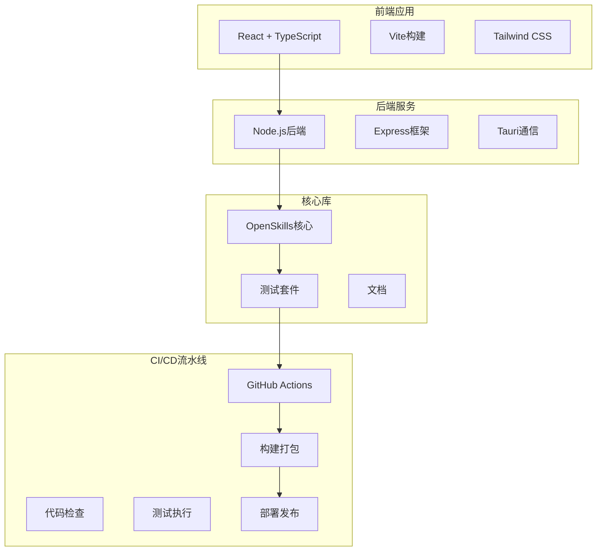

**图表来源**
- [package.json](file://package.json#L1-L47)
- [pyproject.toml](file://OpenSkills-main/pyproject.toml#L1-L75)

**章节来源**
- [package.json](file://package.json#L1-L47)
- [pyproject.toml](file://OpenSkills-main/pyproject.toml#L1-L75)

## 核心组件

### GitHub Actions工作流

项目实现了两套核心CI/CD工作流：

1. **CI工作流**：负责代码质量检查和基础测试
2. **发布工作流**：负责包构建、测试和发布到PyPI

### 代码质量检查

使用Ruff进行Python代码风格检查和格式化：

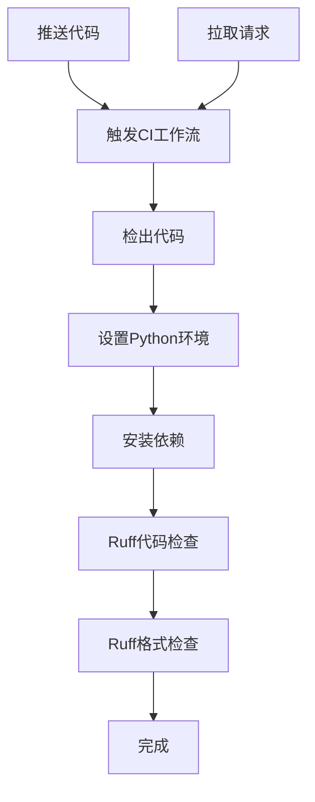

**图表来源**
- [ci.yml](file://OpenSkills-main/.github/workflows/ci.yml#L1-L32)

### 测试自动化

项目包含全面的测试套件，覆盖核心功能模块：

- **LLM模块测试**：消息处理、图像内容、多模态支持
- **技能管理测试**：技能发现、匹配、加载
- **解析器测试**：SKILL.md文件解析
- **沙箱集成测试**：依赖管理、命令执行

**章节来源**
- [ci.yml](file://OpenSkills-main/.github/workflows/ci.yml#L1-L32)
- [test_llm.py](file://OpenSkills-main/tests/test_llm.py#L1-L235)
- [test_manager.py](file://OpenSkills-main/tests/test_manager.py#L1-L170)
- [test_matcher.py](file://OpenSkills-main/tests/test_matcher.py#L1-L99)
- [test_parser.py](file://OpenSkills-main/tests/test_parser.py#L1-L227)
- [test_sandbox.py](file://OpenSkills-main/tests/test_sandbox.py#L1-L297)

## 架构概览

### CI/CD流水线架构

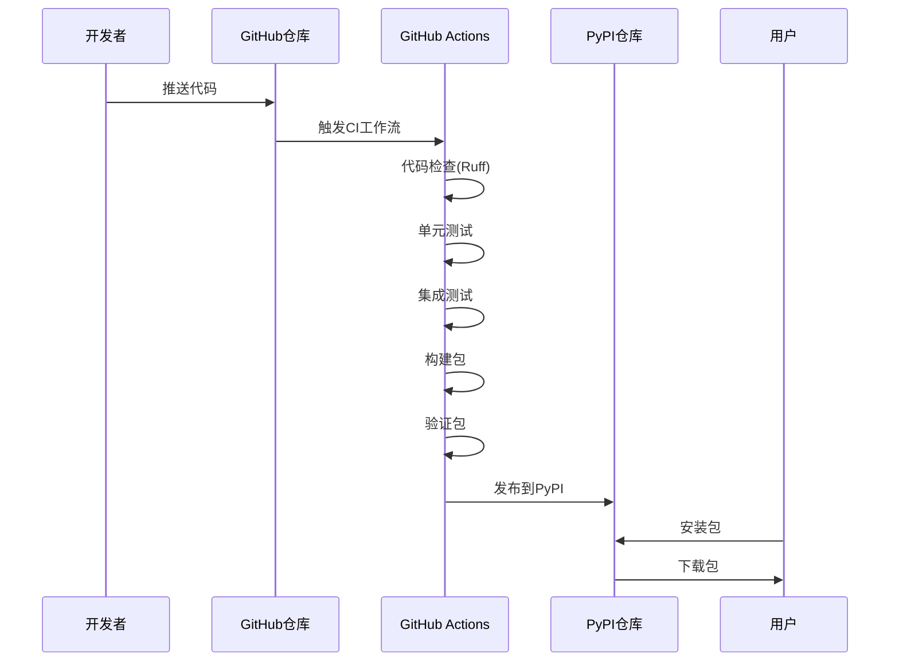

**图表来源**
- [publish.yml](file://OpenSkills-main/.github/workflows/publish.yml#L1-L99)

### 沙箱集成架构

项目支持多种沙箱环境集成：

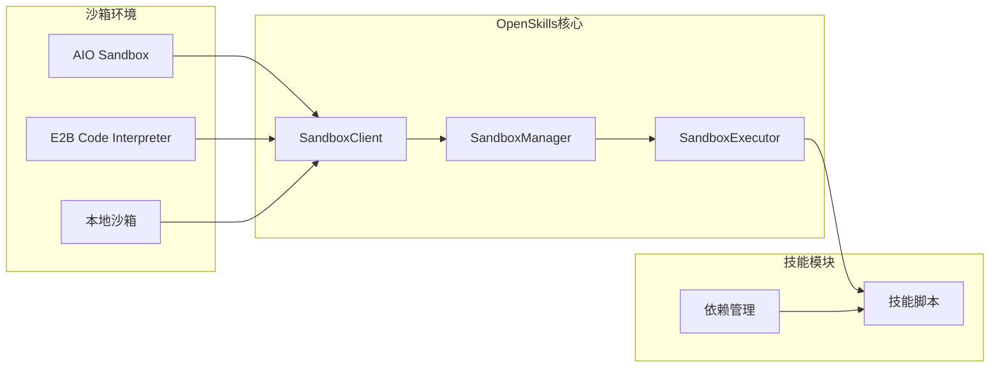

**图表来源**
- [sandbox.md](file://OpenSkills-main/docs/sandbox.md#L1-L258)
- [e2b-integration.md](file://OpenSkills-main/docs/e2b-integration.md#L1-L219)

**章节来源**
- [publish.yml](file://OpenSkills-main/.github/workflows/publish.yml#L1-L99)
- [sandbox.md](file://OpenSkills-main/docs/sandbox.md#L1-L258)
- [e2b-integration.md](file://OpenSkills-main/docs/e2b-integration.md#L1-L219)

## 详细组件分析

### Python包管理

项目使用现代Python包管理工具：

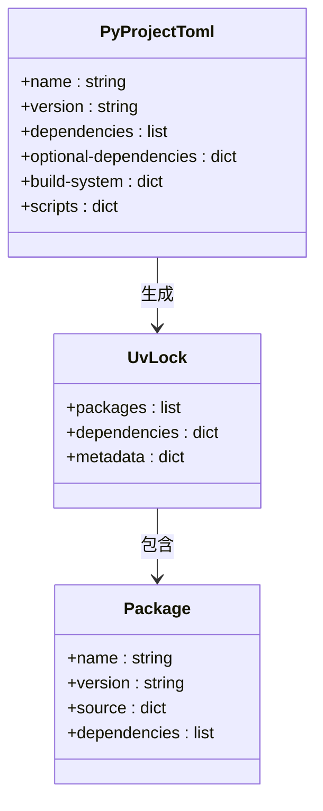

**图表来源**
- [pyproject.toml](file://OpenSkills-main/pyproject.toml#L1-L75)
- [uv.lock](file://OpenSkills-main/uv.lock#L1-L583)

### 前端构建系统

前端使用现代化构建工具链：

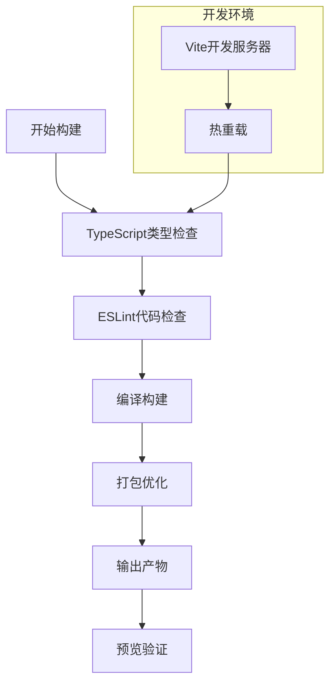

**图表来源**
- [package.json](file://package.json#L1-L47)

**章节来源**
- [pyproject.toml](file://OpenSkills-main/pyproject.toml#L1-L75)
- [uv.lock](file://OpenSkills-main/uv.lock#L1-L583)
- [package.json](file://package.json#L1-L47)

### 测试策略

项目实施多层次测试策略：

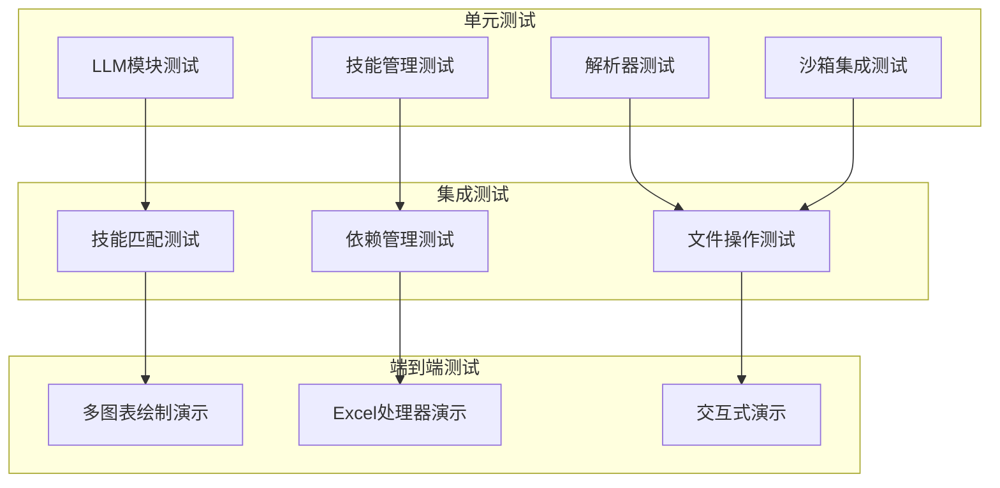

**图表来源**
- [test_llm.py](file://OpenSkills-main/tests/test_llm.py#L1-L235)
- [test_manager.py](file://OpenSkills-main/tests/test_manager.py#L1-L170)
- [test_matcher.py](file://OpenSkills-main/tests/test_matcher.py#L1-L99)
- [test_parser.py](file://OpenSkills-main/tests/test_parser.py#L1-L227)
- [test_sandbox.py](file://OpenSkills-main/tests/test_sandbox.py#L1-L297)
- [demo.py](file://OpenSkills-main/examples/multi-chart-draw/demo.py#L1-L261)

**章节来源**
- [test_llm.py](file://OpenSkills-main/tests/test_llm.py#L1-L235)
- [test_manager.py](file://OpenSkills-main/tests/test_manager.py#L1-L170)
- [test_matcher.py](file://OpenSkills-main/tests/test_matcher.py#L1-L99)
- [test_parser.py](file://OpenSkills-main/tests/test_parser.py#L1-L227)
- [test_sandbox.py](file://OpenSkills-main/tests/test_sandbox.py#L1-L297)
- [demo.py](file://OpenSkills-main/examples/multi-chart-draw/demo.py#L1-L261)

## 依赖关系分析

### Python依赖管理

项目采用声明式依赖管理：

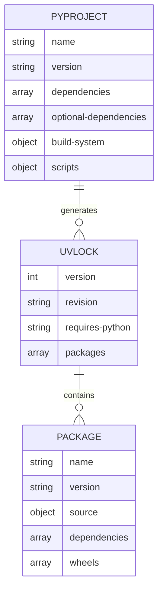

**图表来源**
- [pyproject.toml](file://OpenSkills-main/pyproject.toml#L1-L75)
- [uv.lock](file://OpenSkills-main/uv.lock#L1-L583)

### 前端依赖管理

前端使用npm包管理器：

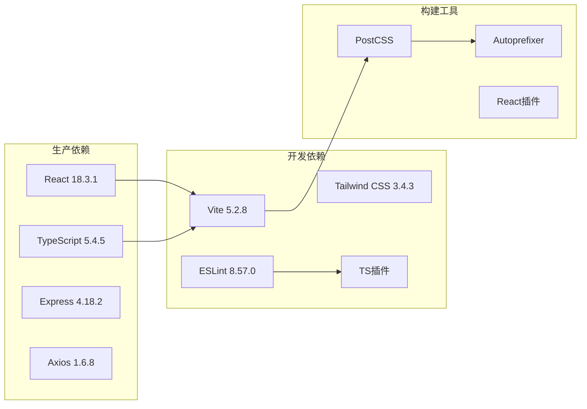

**图表来源**
- [package.json](file://package.json#L1-L47)

**章节来源**
- [pyproject.toml](file://OpenSkills-main/pyproject.toml#L1-L75)
- [uv.lock](file://OpenSkills-main/uv.lock#L1-L583)
- [package.json](file://package.json#L1-L47)

## 性能考虑

### 构建缓存优化

项目实现了多层缓存策略：

1. **依赖缓存**：使用uv进行快速依赖解析
2. **构建缓存**：Vite的模块缓存机制
3. **测试缓存**：pytest的增量测试执行

### 并行执行

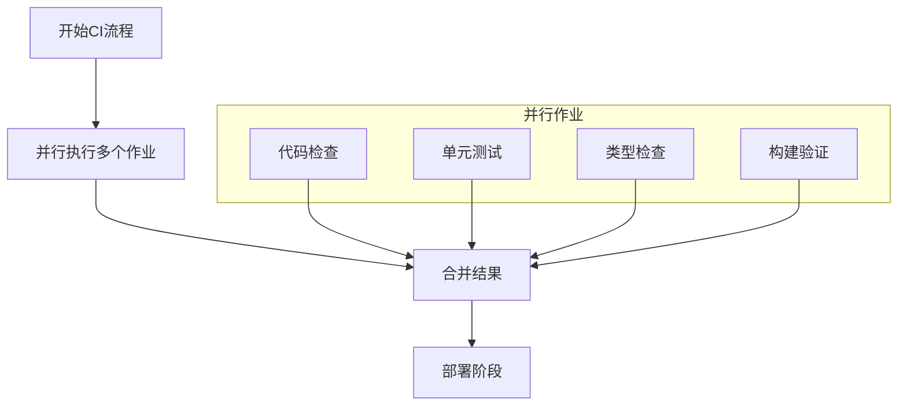

### 失败回滚机制

发布流程包含完善的回滚策略：

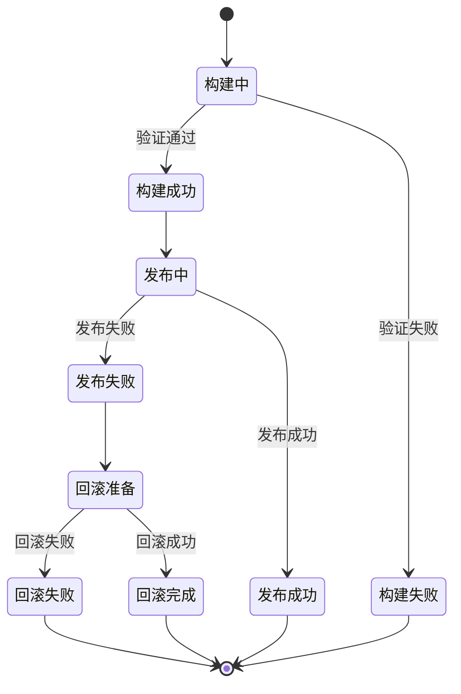

## 故障排除指南

### 常见问题诊断

1. **依赖安装失败**
   - 检查网络连接和PyPI可达性
   - 验证Python版本兼容性
   - 清理缓存后重试

2. **测试失败**
   - 查看具体的测试错误日志
   - 验证环境变量配置
   - 检查沙箱服务状态

3. **构建失败**
   - 检查TypeScript编译错误
   - 验证依赖版本兼容性
   - 查看构建日志中的具体错误

### 调试工具

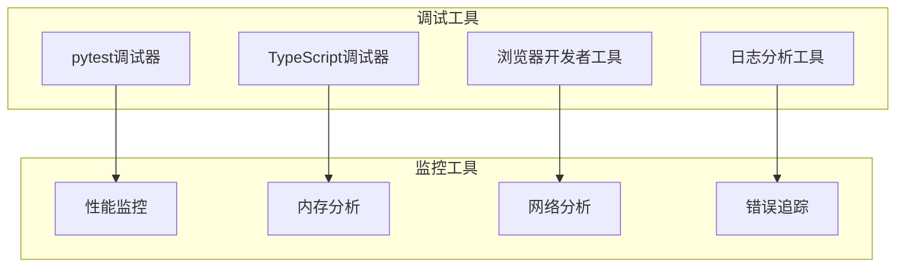

**章节来源**
- [test_sandbox.py](file://OpenSkills-main/tests/test_sandbox.py#L1-L297)
- [sandbox.md](file://OpenSkills-main/docs/sandbox.md#L1-L258)

## 结论

AutoMate项目实现了完整的CI/CD自动化解决方案，具有以下特点：

1. **全面的测试覆盖**：从单元测试到端到端测试的多层次保障
2. **现代化的工具链**：使用最新的Python和JavaScript工具
3. **灵活的部署策略**：支持多种沙箱环境和部署方式
4. **完善的监控机制**：包含构建缓存、并行执行和失败回滚

该自动化流程确保了代码质量、构建稳定性和发布可靠性，为项目的持续发展提供了坚实的技术基础。