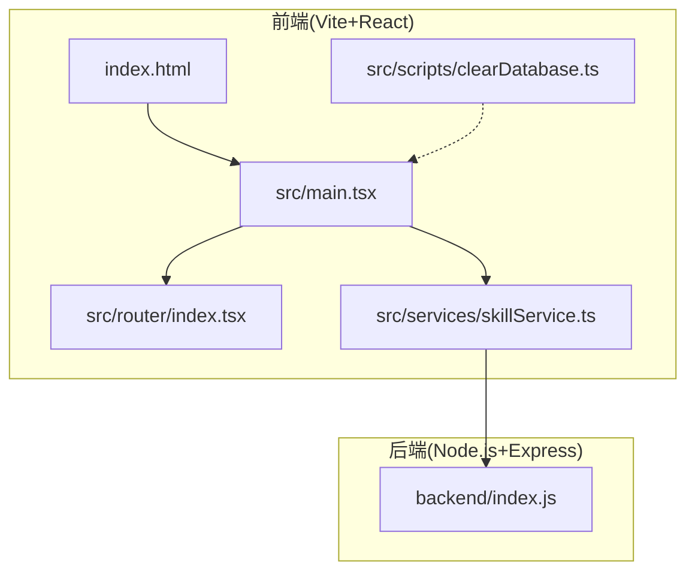
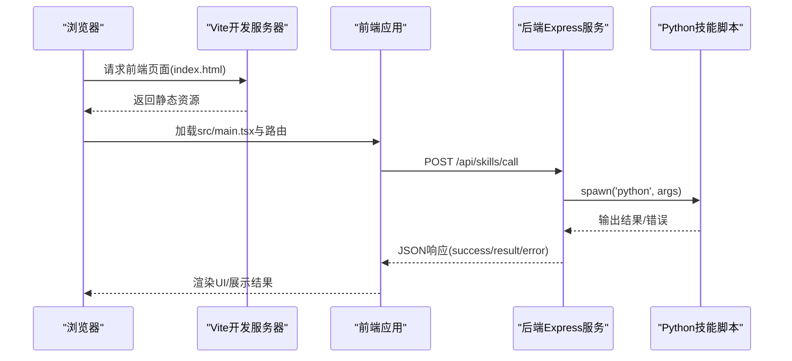
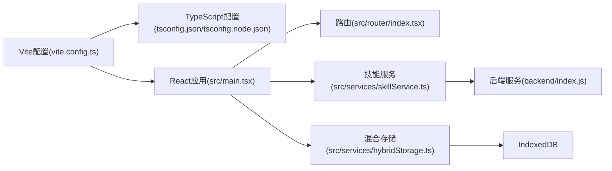

# 开发环境部署

<cite>
**本文引用的文件**
- [package.json](file://package.json)
- [vite.config.ts](file://vite.config.ts)
- [tsconfig.json](file://tsconfig.json)
- [tsconfig.node.json](file://tsconfig.node.json)
- [tailwind.config.ts](file://tailwind.config.ts)
- [backend/index.js](file://backend/index.js)
- [src/main.tsx](file://src/main.tsx)
- [index.html](file://index.html)
- [src/router/index.tsx](file://src/router/index.tsx)
- [src/services/skillService.ts](file://src/services/skillService.ts)
- [src/scripts/clearDatabase.ts](file://src/scripts/clearDatabase.ts)
- [src/services/chatHistoryService.ts](file://src/services/chatHistoryService.ts)
- [src/services/hybridStorage.ts](file://src/services/hybridStorage.ts)
- [docs/基础规范/开发环境配置.md](file://docs/基础规范/开发环境配置.md)
- [.trae/修复sql.js加载错误计划.md](file://.trae/修复sql.js加载错误计划.md)
- [docs/数据层设计/数据库设计.md](file://docs/数据层设计/数据库设计.md)
</cite>

## 目录
1. [简介](#简介)
2. [项目结构](#项目结构)
3. [核心组件](#核心组件)
4. [架构总览](#架构总览)
5. [详细组件分析](#详细组件分析)
6. [依赖关系分析](#依赖关系分析)
7. [性能考虑](#性能考虑)
8. [故障排查指南](#故障排查指南)
9. [结论](#结论)
10. [附录](#附录)

## 简介
本指南面向AutoMate项目的开发团队，提供从零搭建前后端分离开发环境的完整步骤，涵盖Node.js与包管理器（npm/yarn）、TypeScript编译器、Vite开发服务器的配置；并详细说明前端React应用与后端Node.js服务的并行运行方式、开发依赖安装、环境变量配置、本地数据库设置、IDE与调试工具配置、热重载机制，以及常见问题排查与解决方案。

## 项目结构
AutoMate采用前后端分离架构：
- 前端：基于Vite + React + TypeScript，使用TailwindCSS进行样式管理，入口为index.html与src/main.tsx。
- 后端：基于Node.js + Express，提供技能调用API，位于backend/index.js。
- 数据层：前端采用IndexedDB作为主要本地存储，并结合SQLite持久化策略（文档中描述），同时提供混合存储与清理脚本。

图表来源
- [index.html](file://index.html#L1-L15)
- [src/main.tsx](file://src/main.tsx#L1-L12)
- [src/router/index.tsx](file://src/router/index.tsx#L1-L43)
- [src/services/skillService.ts](file://src/services/skillService.ts#L1-L73)
- [backend/index.js](file://backend/index.js#L1-L117)

章节来源
- [package.json](file://package.json#L1-L47)
- [vite.config.ts](file://vite.config.ts#L1-L47)
- [tsconfig.json](file://tsconfig.json#L1-L26)
- [tsconfig.node.json](file://tsconfig.node.json#L1-L11)
- [tailwind.config.ts](file://tailwind.config.ts#L1-L161)
- [backend/index.js](file://backend/index.js#L1-L117)
- [src/main.tsx](file://src/main.tsx#L1-L12)
- [index.html](file://index.html#L1-L15)
- [src/router/index.tsx](file://src/router/index.tsx#L1-L43)
- [src/services/skillService.ts](file://src/services/skillService.ts#L1-L73)
- [src/scripts/clearDatabase.ts](file://src/scripts/clearDatabase.ts#L1-L40)
- [src/services/chatHistoryService.ts](file://src/services/chatHistoryService.ts#L59-L85)
- [src/services/hybridStorage.ts](file://src/services/hybridStorage.ts#L61-L96)

## 核心组件
- 包管理与脚本
  - 使用npm/yarn进行依赖安装与脚本执行，提供dev/build/preview/lint/typecheck/backend/start等脚本。
- TypeScript编译器
  - tsconfig.json与tsconfig.node.json分别配置应用与Vite配置文件的编译选项，启用严格模式与路径别名。
- Vite开发服务器
  - 配置React插件、路径别名、代理规则、构建产物与代码分割策略。
- TailwindCSS
  - 配置内容扫描范围、主题扩展、动画与暗色模式支持。
- 后端服务
  - Express提供技能调用API，支持Python子进程执行技能脚本，并返回结果或错误。
- 前端路由与服务
  - React Router负责页面路由，skillService封装API调用，支持超时与网络错误处理。
- 本地数据库与混合存储
  - IndexedDB用于热数据缓存，SQLite用于持久化，提供清理脚本与数据迁移策略。

章节来源
- [package.json](file://package.json#L6-L13)
- [tsconfig.json](file://tsconfig.json#L2-L22)
- [tsconfig.node.json](file://tsconfig.node.json#L2-L9)
- [vite.config.ts](file://vite.config.ts#L5-L46)
- [tailwind.config.ts](file://tailwind.config.ts#L3-L161)
- [backend/index.js](file://backend/index.js#L11-L117)
- [src/router/index.tsx](file://src/router/index.tsx#L7-L36)
- [src/services/skillService.ts](file://src/services/skillService.ts#L3-L61)
- [src/scripts/clearDatabase.ts](file://src/scripts/clearDatabase.ts#L4-L34)
- [src/services/chatHistoryService.ts](file://src/services/chatHistoryService.ts#L61-L85)
- [src/services/hybridStorage.ts](file://src/services/hybridStorage.ts#L63-L96)

## 架构总览
AutoMate的开发环境由前端Vite服务器与后端Express服务器组成，二者通过HTTP代理与路由协同工作。前端通过skillService调用后端API，后端通过子进程执行Python技能脚本并返回结果。

图表来源
- [index.html](file://index.html#L10-L12)
- [src/main.tsx](file://src/main.tsx#L7-L11)
- [src/router/index.tsx](file://src/router/index.tsx#L7-L36)
- [src/services/skillService.ts](file://src/services/skillService.ts#L20-L33)
- [backend/index.js](file://backend/index.js#L19-L79)

## 详细组件分析

### Vite开发服务器配置
- 插件与别名
  - 使用@vitejs/plugin-react，路径别名@指向src目录，便于导入。
- 服务器与代理
  - 端口3000，自动打开浏览器，允许访问上级目录；配置/api/proxy与/api/skills代理规则，将前端请求转发至目标服务。
- 构建与代码分割
  - 输出目录dist，开启source map；手动拆分vendor包，提升缓存与加载效率。
- public目录
  - publicDir设为public，静态资源按需放置。

章节来源
- [vite.config.ts](file://vite.config.ts#L5-L46)

### TypeScript编译器设置
- 应用编译选项
  - ES2020目标、ESNext模块、bundler解析、JSX为react-jsx、严格模式、路径别名@/*映射src/*。
- Node配置
  - tsconfig.node.json用于Vite配置文件，启用bundler解析与ESNext模块。
- 路径与引用
  - tsconfig.json包含src并引用tsconfig.node.json，确保Vite与应用编译一致。

章节来源
- [tsconfig.json](file://tsconfig.json#L2-L24)
- [tsconfig.node.json](file://tsconfig.node.json#L2-L9)

### TailwindCSS样式配置
- 内容扫描
  - 扫描index.html与src下所有TS/JS/TSX/JS文件，确保按需生成样式。
- 暗色模式
  - 使用class策略，支持主题切换。
- 主题扩展
  - 定义颜色、字体、字号、字重、间距、圆角、阴影、过渡、动画与响应式断点。
- 插件
  - 当前为空，预留扩展空间。

章节来源
- [tailwind.config.ts](file://tailwind.config.ts#L4-L161)

### 后端Node.js服务
- 服务器与中间件
  - Express实例，启用CORS与JSON解析。
- 技能执行
  - 通过child_process.spawn调用python脚本，传递参数与工作目录，收集stdout/stderr，根据退出码返回成功或错误。
- API端点
  - POST /api/skills/call：接收skill_name与parameters，调用executeSkill并返回结果。
  - GET /api/skills：健康检查响应。
- 端口与日志
  - 监听3001端口，打印技能目录与执行日志。

章节来源
- [backend/index.js](file://backend/index.js#L11-L117)

### 前端React应用与路由
- 入口与渲染
  - index.html中挂载#root，src/main.tsx创建根节点并渲染AppRouter。
- 路由配置
  - 主布局包裹各页面，支持/、/agent/:agentId、/settings与通配符重定向。
- 技能服务
  - skillService封装API调用，统一处理超时与网络错误，支持传入messageId与agentId。

章节来源
- [index.html](file://index.html#L10-L12)
- [src/main.tsx](file://src/main.tsx#L7-L11)
- [src/router/index.tsx](file://src/router/index.tsx#L7-L36)
- [src/services/skillService.ts](file://src/services/skillService.ts#L12-L61)

### 本地数据库与混合存储
- IndexedDB初始化
  - hybridStorage与chatHistoryService均通过openDB创建数据库automate-db，包含chat_messages与skill_calls表及索引。
- 数据清理脚本
  - clearDatabase脚本支持清空localStorage中的SQLite备份、删除IndexedDB数据库、清除清理标记，便于开发调试。
- 混合存储策略
  - 文档描述SQLite为主存储、IndexedDB为热缓存，提供读写流程与索引设计，支持数据同步接口。

章节来源
- [src/services/hybridStorage.ts](file://src/services/hybridStorage.ts#L63-L96)
- [src/services/chatHistoryService.ts](file://src/services/chatHistoryService.ts#L61-L85)
- [src/scripts/clearDatabase.ts](file://src/scripts/clearDatabase.ts#L4-L34)
- [docs/数据层设计/数据库设计.md](file://docs/数据层设计/数据库设计.md#L597-L728)

### 开发依赖与脚本
- 依赖与脚本
  - package.json定义dev/build/preview/lint/typecheck/backend/start脚本，使用concurrently并行启动前端与后端。
- ESLint与TypeScript
  - ESLint配置与TypeScript类型检查集成，保证代码质量与类型安全。

章节来源
- [package.json](file://package.json#L6-L13)
- [package.json](file://package.json#L28-L45)

## 依赖关系分析
- 前端对后端的依赖
  - 前端通过skillService调用后端API，后端依赖Python环境执行技能脚本。
- Vite与TypeScript
  - Vite读取tsconfig.json与tsconfig.node.json，确保编译与打包一致性。
- TailwindCSS
  - 通过content扫描确保样式按需生成，避免无用样式。
- 数据层
  - 前端通过hybridStorage与chatHistoryService访问IndexedDB，后端不直接参与前端数据存储。

图表来源
- [vite.config.ts](file://vite.config.ts#L5-L46)
- [tsconfig.json](file://tsconfig.json#L2-L24)
- [tsconfig.node.json](file://tsconfig.node.json#L2-L9)
- [src/main.tsx](file://src/main.tsx#L7-L11)
- [src/router/index.tsx](file://src/router/index.tsx#L7-L36)
- [src/services/skillService.ts](file://src/services/skillService.ts#L20-L33)
- [backend/index.js](file://backend/index.js#L11-L117)
- [src/services/hybridStorage.ts](file://src/services/hybridStorage.ts#L63-L96)

## 性能考虑
- 代码分割
  - 通过manualChunks将react、router、state、ui等第三方库拆分为独立chunk，提升缓存命中率。
- Source Map
  - 构建开启sourcemap，便于开发调试与问题定位。
- 代理与跨域
  - Vite代理/api/skills指向后端3001端口，避免CORS问题与跨域限制。
- 热重载
  - Vite提供快速热重载与模块替换，提升开发效率。

章节来源
- [vite.config.ts](file://vite.config.ts#L32-L45)
- [vite.config.ts](file://vite.config.ts#L12-L30)

## 故障排查指南
- 启动位置与路径
  - 开发服务器应在项目根目录启动，避免访问上级目录受限导致配置文件加载失败。
- 端口冲突
  - Vite默认端口3000，后端默认3001；若端口被占用，需更换端口或释放占用进程。
- 技能调用失败
  - 检查后端服务是否运行（npm run backend），确认Python可执行文件存在且路径正确。
- 网络请求错误
  - skillService对ERR_NETWORK进行特殊处理，提示“请确保后端服务正在运行”，建议先启动后端再发起请求。
- 数据库问题
  - 使用clearDatabase脚本清理IndexedDB与localStorage中的SQLite备份，必要时重启浏览器以重新初始化。
- sql.js加载错误
  - 若出现SqlJs.default不是函数的错误，可参考修复计划移除sql.js依赖，采用纯IndexedDB方案。

章节来源
- [docs/基础规范/开发环境配置.md](file://docs/基础规范/开发环境配置.md#L13-L29)
- [docs/基础规范/开发环境配置.md](file://docs/基础规范/开发环境配置.md#L163-L167)
- [src/services/skillService.ts](file://src/services/skillService.ts#L37-L54)
- [src/scripts/clearDatabase.ts](file://src/scripts/clearDatabase.ts#L4-L34)
- [.trae/修复sql.js加载错误计划.md](file://.trae/修复sql.js加载错误计划.md#L1-L34)

## 结论
通过以上配置与流程，AutoMate实现了前后端分离的高效开发环境：前端使用Vite+React+TypeScript，后端使用Node.js+Express，配合TailwindCSS与IndexedDB/SQLite混合存储。借助concurrently实现前后端并行运行，配合代理与热重载机制，显著提升开发体验。遇到常见问题时，可依据本文提供的排查步骤快速定位并解决。

## 附录

### 安装与启动步骤
- 安装Node.js与包管理器
  - 使用nvm或直接下载安装Node.js（含npm），确保版本满足项目需求。
- 安装依赖
  - 在项目根目录执行安装命令，安装package.json中声明的依赖。
- 启动开发环境
  - 并行启动前端与后端：npm run start（内部使用concurrently）。
  - 单独启动前端：npm run dev（Vite开发服务器运行在3000端口）。
  - 单独启动后端：npm run backend（Express服务运行在3001端口）。
- 构建与预览
  - 构建：npm run build（先TypeScript编译，再Vite打包）。
  - 预览：npm run preview（本地预览构建产物）。

章节来源
- [package.json](file://package.json#L6-L13)

### IDE与调试工具配置建议
- VS Code推荐插件
  - ESLint、TypeScript Importer、Tailwind CSS IntelliSense、ES7+ React/Redux/React-Native snippets。
- 调试配置
  - 前端：Vite自带HMR与SourceMap，可在浏览器开发者工具Sources中设置断点。
  - 后端：Node.js调试可通过VS Code Launch配置，或使用nodemon（如需）。
- 环境变量
  - 如需环境变量，可在项目根目录新增.env文件并按需读取（注意不要提交敏感信息）。

### 环境变量与本地数据库设置
- 环境变量
  - 项目当前未显式使用环境变量，如需可在后端或Vite中按需添加。
- 本地数据库
  - IndexedDB数据库名为automate-db，包含chat_messages与skill_calls表；SQLite持久化策略见文档说明。
  - 使用clearDatabase脚本清理数据，便于重置开发状态。

章节来源
- [src/services/hybridStorage.ts](file://src/services/hybridStorage.ts#L63-L96)
- [src/services/chatHistoryService.ts](file://src/services/chatHistoryService.ts#L61-L85)
- [src/scripts/clearDatabase.ts](file://src/scripts/clearDatabase.ts#L4-L34)
- [docs/数据层设计/数据库设计.md](file://docs/数据层设计/数据库设计.md#L597-L728)