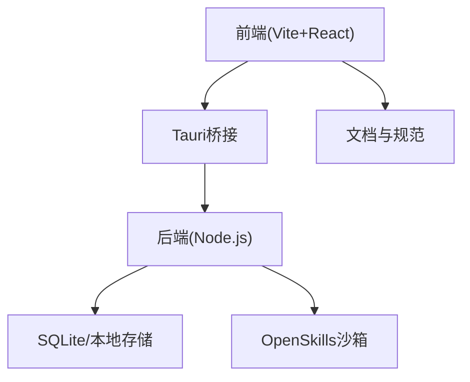
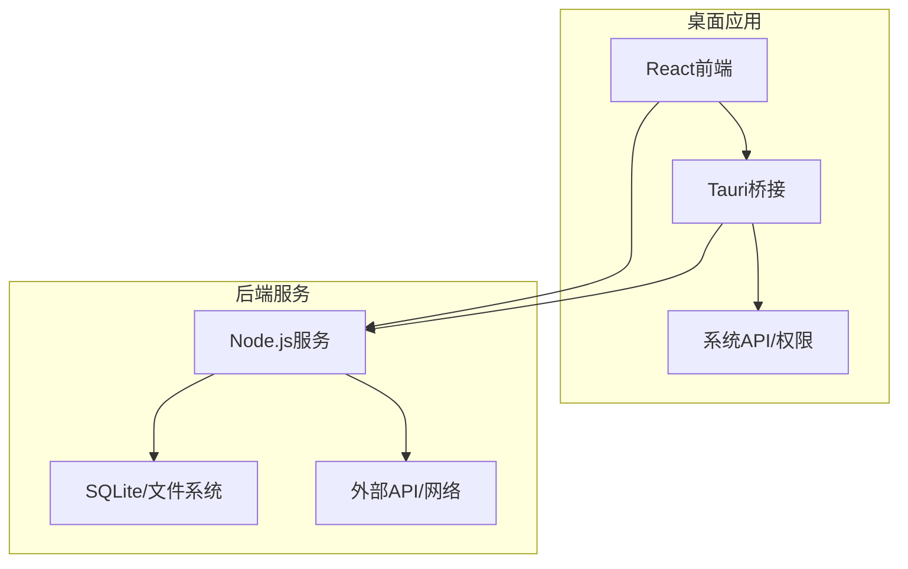
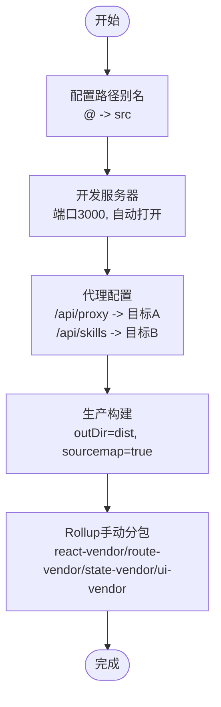
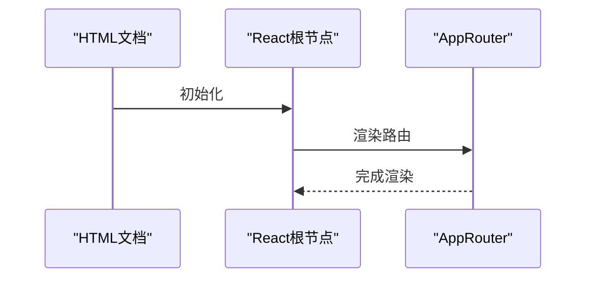
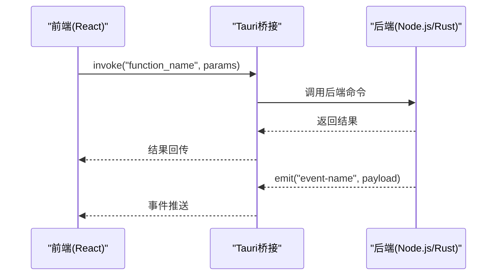
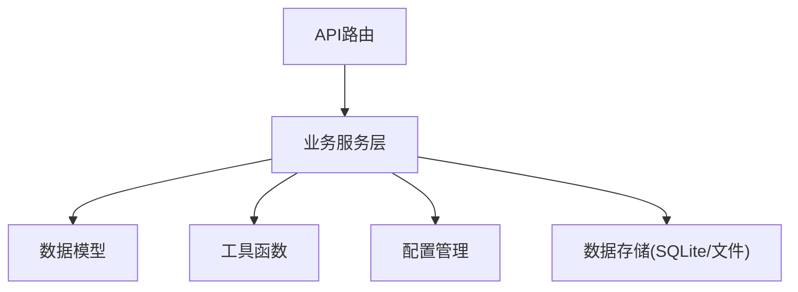
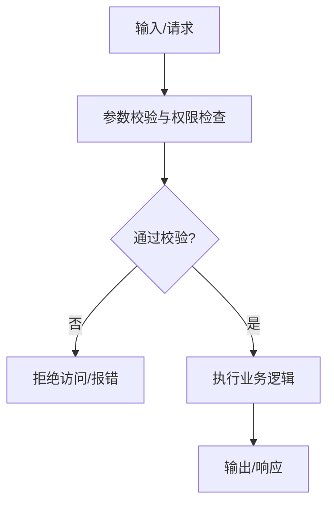
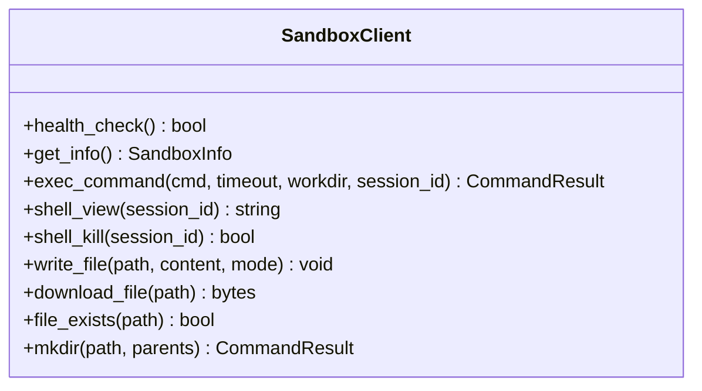
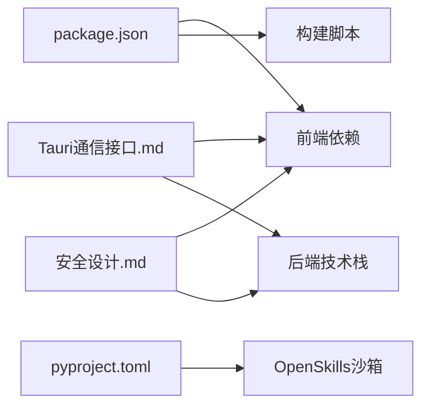

# 桌面应用打包

<cite>
**本文引用的文件**
- [package.json](file://package.json)
- [vite.config.ts](file://vite.config.ts)
- [src/main.tsx](file://src/main.tsx)
- [docs/接口层设计/Tauri通信接口.md](file://docs/接口层设计/Tauri通信接口.md)
- [docs/技术架构/后端技术栈.md](file://docs/技术架构/后端技术栈.md)
- [docs/非功能设计/安全设计.md](file://docs/非功能设计/安全设计.md)
- [OpenSkills-main/pyproject.toml](file://OpenSkills-main/pyproject.toml)
- [OpenSkills-main/openskills/sandbox/client.py](file://OpenSkills-main/openskills/sandbox/client.py)
</cite>

## 目录
1. [简介](#简介)
2. [项目结构](#项目结构)
3. [核心组件](#核心组件)
4. [架构总览](#架构总览)
5. [详细组件分析](#详细组件分析)
6. [依赖关系分析](#依赖关系分析)
7. [性能考虑](#性能考虑)
8. [故障排查指南](#故障排查指南)
9. [结论](#结论)
10. [附录](#附录)

## 简介
本指南面向使用Tauri框架构建AutoMate桌面应用的工程团队，聚焦于跨平台打包流程、平台特定配置与依赖管理，覆盖Windows、macOS与Linux的差异化要点；同时涵盖应用图标、安装程序与数字签名配置思路，以及自动更新机制、版本管理与发布流程的实现方案，并对沙盒环境配置、权限管理与安全策略给出可落地的建议。

## 项目结构
AutoMate采用前端React + Vite + TypeScript，后端以Node.js为主（含Express、SQLite等），并通过Tauri桥接前后端通信。前端构建产物由Vite产出，后端服务与数据库位于backend目录，文档与安全策略集中在docs目录，技能沙箱能力来自OpenSkills子项目。

**图示来源**
- [package.json](file://package.json#L1-L47)
- [vite.config.ts](file://vite.config.ts#L1-L47)
- [src/main.tsx](file://src/main.tsx#L1-L12)
- [docs/接口层设计/Tauri通信接口.md](file://docs/接口层设计/Tauri通信接口.md#L1-L25)
- [docs/技术架构/后端技术栈.md](file://docs/技术架构/后端技术栈.md#L344-L372)

**章节来源**
- [package.json](file://package.json#L1-L47)
- [vite.config.ts](file://vite.config.ts#L1-L47)
- [src/main.tsx](file://src/main.tsx#L1-L12)

## 核心组件
- 前端构建与开发服务器：Vite配置包含别名、代理、分包策略与源码映射，服务于开发与生产构建。
- 应用入口：React根节点挂载AppRouter，统一路由入口。
- 通信协议：Tauri invoke与事件系统，定义了前后端调用与消息推送的契约。
- 后端技术栈：Node.js、Express、SQLite、Playwright等，支撑消息、技能与网页自动化能力。
- 安全设计：数据加密、权限控制、防注入、沙箱隔离与传输安全等策略。
- 沙箱能力：OpenSkills提供的沙箱客户端，支持健康检查、命令执行、文件读写与会话管理。

**章节来源**
- [vite.config.ts](file://vite.config.ts#L1-L47)
- [src/main.tsx](file://src/main.tsx#L1-L12)
- [docs/接口层设计/Tauri通信接口.md](file://docs/接口层设计/Tauri通信接口.md#L1-L25)
- [docs/技术架构/后端技术栈.md](file://docs/技术架构/后端技术栈.md#L1-L380)
- [docs/非功能设计/安全设计.md](file://docs/非功能设计/安全设计.md#L1-L434)
- [OpenSkills-main/openskills/sandbox/client.py](file://OpenSkills-main/openskills/sandbox/client.py#L199-L743)

## 架构总览
下图展示Tauri桥接下的典型桌面应用架构：前端负责UI与交互，后端承载业务逻辑与数据持久化，Tauri提供安全的原生通道与系统能力。

**图示来源**
- [docs/接口层设计/Tauri通信接口.md](file://docs/接口层设计/Tauri通信接口.md#L15-L24)
- [docs/技术架构/后端技术栈.md](file://docs/技术架构/后端技术栈.md#L1-L380)

## 详细组件分析

### 组件A：前端构建与打包（Vite）
- 别名与开发服务器：@指向src，端口3000，开放自动打开，代理/api/proxy与/api/skills。
- 生产构建：输出至dist，开启sourcemap，Rollup手动分包策略，拆分React、路由、状态与UI依赖。
- 公共资源：publicDir指向public目录。

**图示来源**
- [vite.config.ts](file://vite.config.ts#L5-L46)

**章节来源**
- [vite.config.ts](file://vite.config.ts#L1-L47)

### 组件B：应用入口与路由
- React根节点挂载AppRouter，全局样式引入，形成统一渲染入口。

**图示来源**
- [src/main.tsx](file://src/main.tsx#L1-L12)

**章节来源**
- [src/main.tsx](file://src/main.tsx#L1-L12)

### 组件C：Tauri通信接口（invoke与事件）
- invoke API：前端通过@tauri-apps/api调用后端函数，后端通过Rust侧暴露命令或通过Node.js实现。
- 事件系统：后端向前端推送事件，前端监听并处理。
- 权限与参数校验：建议在后端实现参数校验与权限检查，保障调用安全。

**图示来源**
- [docs/接口层设计/Tauri通信接口.md](file://docs/接口层设计/Tauri通信接口.md#L25-L61)
- [docs/接口层设计/Tauri通信接口.md](file://docs/接口层设计/Tauri通信接口.md#L545-L621)

**章节来源**
- [docs/接口层设计/Tauri通信接口.md](file://docs/接口层设计/Tauri通信接口.md#L1-L1013)

### 组件D：后端技术栈与数据库
- Node.js与Express：提供REST风格API与中间件，支撑消息、智能体与技能管理。
- SQLite：本地数据库，配合文件系统存储附件与配置。
- Playwright：浏览器自动化，满足网页操作与数据抓取需求。
- 项目结构：按api、services、models、utils、config、data划分，便于维护与扩展。

**图示来源**
- [docs/技术架构/后端技术栈.md](file://docs/技术架构/后端技术栈.md#L344-L372)

**章节来源**
- [docs/技术架构/后端技术栈.md](file://docs/技术架构/后端技术栈.md#L1-L380)

### 组件E：安全设计与权限控制
- 数据加密：聊天数据与敏感信息采用AES-256等算法，密钥管理遵循最小权限与定期轮换。
- 权限控制：文件权限、API鉴权与技能白名单，结合参数校验与访问审计。
- 沙箱隔离：进程隔离、虚拟环境与路径限制，降低技能执行风险。
- 传输安全：HTTPS/TLS与传输加密，保障数据在链路中的机密性。

**图示来源**
- [docs/非功能设计/安全设计.md](file://docs/非功能设计/安全设计.md#L90-L193)

**章节来源**
- [docs/非功能设计/安全设计.md](file://docs/非功能设计/安全设计.md#L1-L434)

### 组件F：OpenSkills沙箱客户端
- 健康检查：确认沙箱可用性。
- 信息获取：版本、操作系统、可用工具与运行时信息。
- Shell命令：执行命令、查看输出、终止会话。
- 文件操作：写入、下载、存在性检查与目录创建。
- 代码执行：面向技能执行的API集合。

**图示来源**
- [OpenSkills-main/openskills/sandbox/client.py](file://OpenSkills-main/openskills/sandbox/client.py#L199-L743)

**章节来源**
- [OpenSkills-main/openskills/sandbox/client.py](file://OpenSkills-main/openskills/sandbox/client.py#L199-L743)

## 依赖关系分析
- 前端依赖：React、React Router、Zustand、Lucide等，构建脚本通过Vite与TypeScript编译。
- 后端依赖：Express、SQLite驱动、CORS、Axios等，支撑API与数据访问。
- 文档与规范：Tauri通信接口、后端技术栈、安全设计等文档为开发与打包提供约束与指导。
- 沙箱依赖：OpenSkills子项目提供Python生态与沙箱能力，pyproject.toml定义构建与版本管理。

**图示来源**
- [package.json](file://package.json#L15-L45)
- [docs/接口层设计/Tauri通信接口.md](file://docs/接口层设计/Tauri通信接口.md#L1-L25)
- [docs/技术架构/后端技术栈.md](file://docs/技术架构/后端技术栈.md#L245-L342)
- [docs/非功能设计/安全设计.md](file://docs/非功能设计/安全设计.md#L1-L434)
- [OpenSkills-main/pyproject.toml](file://OpenSkills-main/pyproject.toml#L1-L75)

**章节来源**
- [package.json](file://package.json#L1-L47)
- [OpenSkills-main/pyproject.toml](file://OpenSkills-main/pyproject.toml#L1-L75)

## 性能考虑
- 前端分包：利用Rollup手动分包策略，分离React、路由、状态与UI依赖，减少首屏体积与提升缓存命中率。
- 源码映射：生产开启sourcemap，便于问题定位与回溯。
- 代理与网络：合理配置代理，避免不必要的跨域与重定向开销。
- 后端优化：使用异步I/O与连接池，避免阻塞；对大文件与长任务采用流式处理与超时控制。
- 沙箱性能：命令执行与文件操作应设置超时与资源限制，避免长时间占用。

## 故障排查指南
- Tauri invoke失败：检查命令名称是否匹配、参数类型与权限校验是否通过；前端捕获异常并记录堆栈。
- 事件未到达：确认事件名称一致、监听器未被提前移除；后端发送前进行有效性校验。
- 数据库访问异常：核对数据库路径、权限与连接状态；必要时重建或迁移数据库。
- 沙箱执行失败：检查健康检查、命令合法性与工作目录权限；关注超时与错误输出。
- 安全相关问题：密钥权限、参数校验与访问日志；定期审计权限变更与异常访问。

**章节来源**
- [docs/接口层设计/Tauri通信接口.md](file://docs/接口层设计/Tauri通信接口.md#L936-L1006)
- [docs/非功能设计/安全设计.md](file://docs/非功能设计/安全设计.md#L373-L411)

## 结论
AutoMate的打包与发布应围绕Tauri桥接展开，结合Vite的前端构建、Node.js后端服务与SQLite本地存储，辅以OpenSkills沙箱能力与完善的安全策略。通过标准化的平台配置、图标与安装程序准备、数字签名与自动更新机制，可实现稳定、安全且可维护的跨平台桌面应用交付。

## 附录

### 平台特定配置与打包要点
- Windows
  - 图标与安装程序：准备ICO与安装器资源，配置签名证书与发布渠道。
  - 权限与沙盒：注意路径分隔符与权限继承，确保用户目录与临时目录访问。
- macOS
  - 图标与DMG：遵循Apple Human Interface Guidelines，使用.icns与标准尺寸。
  - 签名与公证：使用Apple Developer证书进行签名与Gatekeeper公证。
- Linux
  - 包格式：DEB/RPM等，准备desktop文件与图标路径。
  - 权限与沙盒：遵循XDG规范，注意用户目录权限与文件系统隔离。

### 应用图标、安装程序与数字签名
- 图标：提供多分辨率矢量与位图，适配不同显示密度与系统主题。
- 安装程序：自定义安装向导、快捷方式与关联文件类型。
- 数字签名：在各平台使用官方证书与工具完成签名与验证。

### 自动更新机制、版本管理与发布流程
- 版本管理：语义化版本号，变更日志与发布标签。
- 自动更新：基于Tauri Updater或第三方方案，实现静默更新与回滚。
- 发布流程：CI/CD流水线自动化构建、签名、打包与发布到各平台渠道。

### 沙盒环境配置、权限管理与安全策略
- 沙盒：进程隔离、资源限制、只读文件系统与受限网络访问。
- 权限：最小权限原则、白名单与参数校验、访问审计。
- 安全：传输加密、密钥管理、防注入与安全扫描。