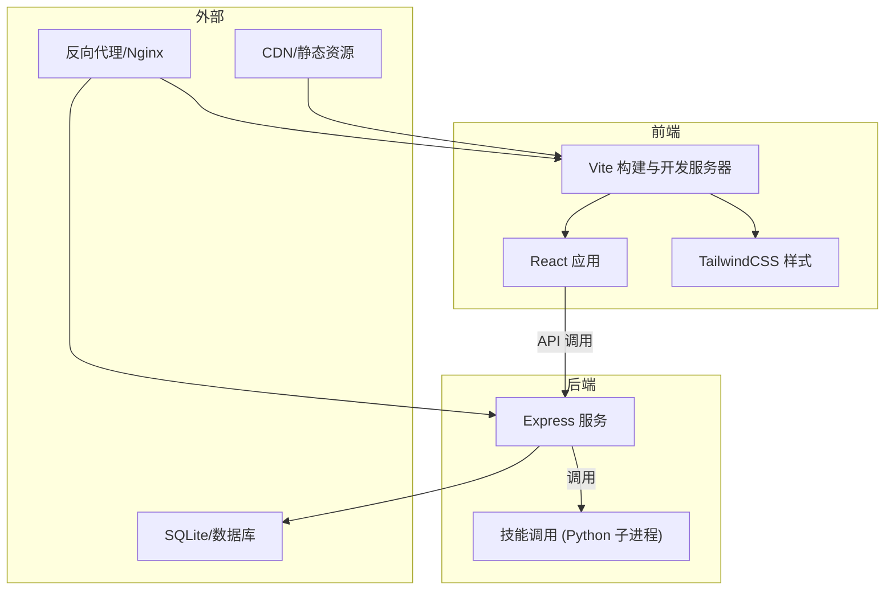
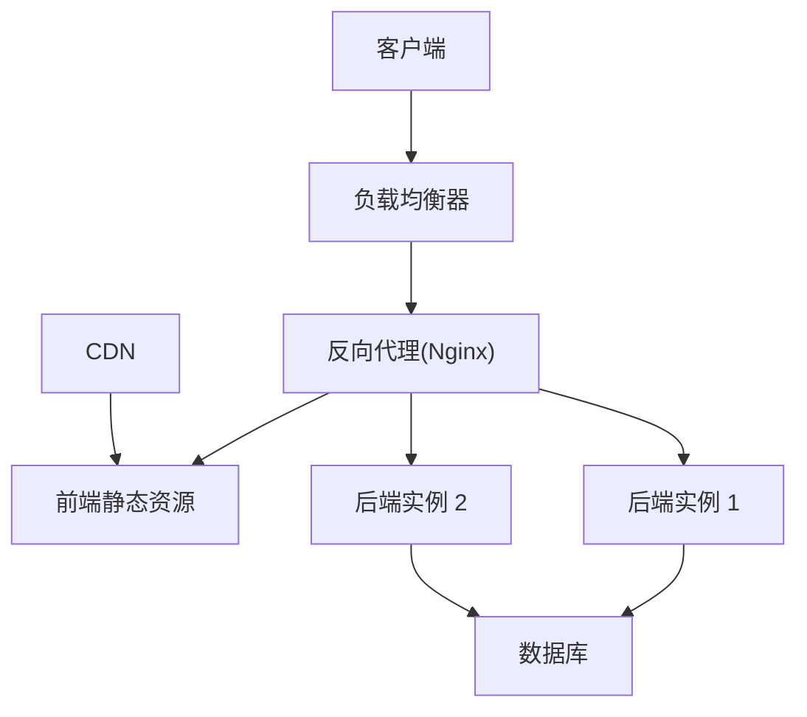
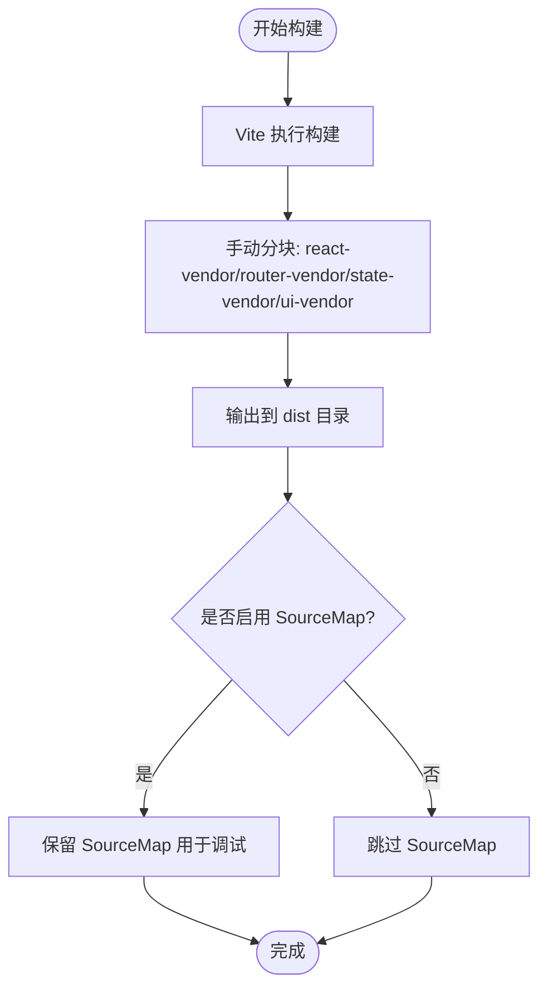
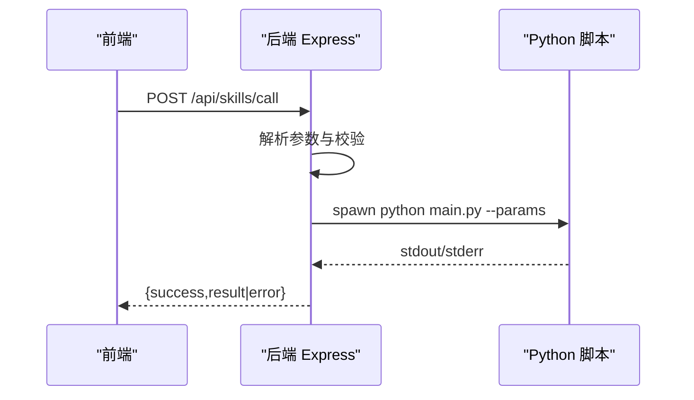
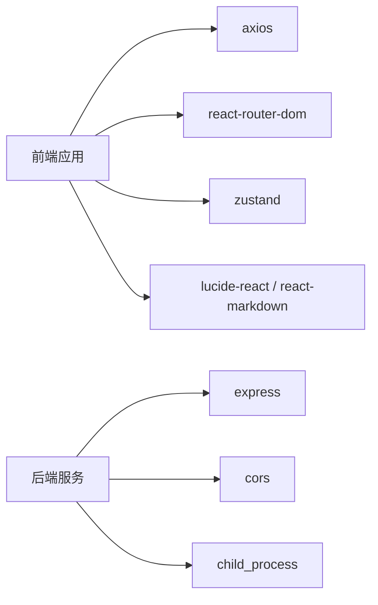

# 生产环境部署

<cite>
**本文引用的文件**
- [package.json](file://package.json)
- [vite.config.ts](file://vite.config.ts)
- [tailwind.config.ts](file://tailwind.config.ts)
- [postcss.config.js](file://postcss.config.js)
- [backend/index.js](file://backend/index.js)
- [docs/技术架构/后端技术栈.md](file://docs/技术架构/后端技术栈.md)
- [docs/非功能设计/性能设计.md](file://docs/非功能设计/性能设计.md)
- [docs/接口层设计/Tauri通信接口.md](file://docs/接口层设计/Tauri通信接口.md)
- [OpenSkills-main/pyproject.toml](file://OpenSkills-main/pyproject.toml)
</cite>

## 目录
1. [简介](#简介)
2. [项目结构](#项目结构)
3. [核心组件](#核心组件)
4. [架构总览](#架构总览)
5. [详细组件分析](#详细组件分析)
6. [依赖关系分析](#依赖关系分析)
7. [性能考量](#性能考量)
8. [故障排查指南](#故障排查指南)
9. [结论](#结论)
10. [附录](#附录)

## 简介
本指南面向AutoMate项目的生产环境部署，覆盖前端构建与静态资源优化、代码分割策略、Tauri桌面应用打包与平台适配、后端服务部署（含PM2进程管理、负载均衡与反向代理）、Docker容器化与云服务配置、数据库连接、SSL证书与域名绑定以及CDN加速策略。内容基于仓库中的实际配置与文档，确保可落地实施。

## 项目结构
AutoMate采用前后端分离架构：
- 前端基于Vite + React + TypeScript，使用TailwindCSS进行样式管理，通过代理与后端及外部API互通。
- 后端以Node.js + Express提供技能调用接口，同时通过子进程调用Python技能脚本。
- 文档中明确了后端技术栈、性能设计与Tauri通信接口，为生产部署提供依据。

图表来源
- [vite.config.ts](file://vite.config.ts#L12-L30)
- [backend/index.js](file://backend/index.js#L11-L16)
- [docs/技术架构/后端技术栈.md](file://docs/技术架构/后端技术栈.md#L291-L312)

章节来源
- [package.json](file://package.json#L6-L13)
- [vite.config.ts](file://vite.config.ts#L1-L47)
- [backend/index.js](file://backend/index.js#L1-L117)

## 核心组件
- 前端构建与优化：Vite配置包含代理、构建输出、SourceMap与手动分块策略，有助于生产环境的资源优化与调试。
- 样式体系：TailwindCSS与PostCSS配置，确保样式按需生成与自动前缀处理。
- 后端服务：Express提供技能调用API，通过子进程执行Python脚本，具备基础的错误处理与日志输出。
- 技术栈与性能：文档明确Node.js、Playwright、SQLite等后端技术栈与性能优化要点，为生产部署提供参考。

章节来源
- [vite.config.ts](file://vite.config.ts#L32-L45)
- [tailwind.config.ts](file://tailwind.config.ts#L1-L161)
- [postcss.config.js](file://postcss.config.js#L1-L7)
- [backend/index.js](file://backend/index.js#L19-L79)
- [docs/技术架构/后端技术栈.md](file://docs/技术架构/后端技术栈.md#L245-L342)
- [docs/非功能设计/性能设计.md](file://docs/非功能设计/性能设计.md#L47-L173)

## 架构总览
生产部署建议采用“反向代理 + 负载均衡 + 容器化 + CDN”的组合方案：
- 反向代理负责SSL终止、静态资源分发、健康检查与上游转发。
- 负载均衡将流量分发至多个后端实例，提升可用性与吞吐。
- 容器化统一运行环境，便于扩缩容与版本管理。
- CDN加速静态资源，缩短全球用户访问延迟。

图表来源
- [docs/技术架构/后端技术栈.md](file://docs/技术架构/后端技术栈.md#L291-L312)
- [docs/非功能设计/性能设计.md](file://docs/非功能设计/性能设计.md#L154-L173)

## 详细组件分析

### 前端构建与静态资源优化
- 构建产物与目录：构建输出至dist目录，便于静态托管。
- SourceMap：生产开启SourceMap，便于问题定位与回溯。
- 代码分割：通过manualChunks将React相关、路由、状态管理与UI库拆分为独立chunk，降低首屏体积并提升缓存命中率。
- 代理与开发：开发服务器配置了/api/proxy与/api/skills代理，生产环境建议由反向代理统一处理。

图表来源
- [vite.config.ts](file://vite.config.ts#L32-L45)

章节来源
- [vite.config.ts](file://vite.config.ts#L32-L45)
- [package.json](file://package.json#L6-L13)

### 样式与工具链
- TailwindCSS：content范围覆盖HTML与所有TSX文件，确保按需生成样式。
- PostCSS：启用TailwindCSS与Autoprefixer，保证跨浏览器兼容性。
- 生产建议：在CI中预编译CSS，结合CDN缓存策略提升加载性能。

章节来源
- [tailwind.config.ts](file://tailwind.config.ts#L4-L7)
- [postcss.config.js](file://postcss.config.js#L1-L7)

### 后端服务与技能调用
- 技能调用流程：接收前端请求，拼装参数，通过子进程调用对应Python脚本，收集标准输出与错误输出，返回统一结构。
- 错误处理：对子进程错误与异常进行捕获并返回结构化错误信息。
- 日志记录：在关键节点打印日志，便于生产排障。

图表来源
- [backend/index.js](file://backend/index.js#L81-L104)
- [backend/index.js](file://backend/index.js#L19-L79)

章节来源
- [backend/index.js](file://backend/index.js#L1-L117)

### Tauri桌面应用打包与平台适配
- 通信接口：文档定义了invoke API与事件系统，支持前后端双向通信。
- 平台适配：Tauri通过Rust后端与Node.js插件协作，可在Windows、macOS、Linux上打包。
- 签名机制：建议在各平台启用代码签名与公证，确保应用可信发布；具体签名流程需结合Tauri CLI与平台要求。

章节来源
- [docs/接口层设计/Tauri通信接口.md](file://docs/接口层设计/Tauri通信接口.md#L1-L1013)

### PM2进程管理、负载均衡与反向代理
- PM2：用于守护Node.js后端进程，支持自动重启、日志聚合与集群模式。
- 负载均衡：建议使用Nginx或硬件负载均衡器，配置健康检查与会话保持（如需）。
- 反向代理：统一处理HTTPS终止、静态资源缓存、Gzip/Brotli压缩与上游转发。

章节来源
- [docs/技术架构/后端技术栈.md](file://docs/技术架构/后端技术栈.md#L82-L89)
- [docs/非功能设计/性能设计.md](file://docs/非功能设计/性能设计.md#L154-L173)

### Docker容器化部署方案
- 前端镜像：基于Nginx或静态站点容器，挂载dist目录提供静态资源。
- 后端镜像：基于Node.js官方镜像，安装依赖后启动Express服务。
- 编排：使用Compose或Kubernetes管理服务与持久化存储。
- 安全：限制容器权限、只读根文件系统、最小化镜像层。

章节来源
- [package.json](file://package.json#L15-L27)
- [backend/index.js](file://backend/index.js#L11-L16)

### 云服务配置与数据库连接
- 云服务：推荐使用云厂商提供的容器服务（如ECS、ACK、Cloud Run）与对象存储（用于静态资源与附件）。
- 数据库：当前项目使用SQLite，生产建议迁移到云数据库（如RDS/云数据库服务），并配置主从复制与备份。
- 连接池：后端可引入连接池库（如better-sqlite3或pg池）以提升并发能力。

章节来源
- [docs/技术架构/后端技术栈.md](file://docs/技术架构/后端技术栈.md#L245-L289)

### SSL证书配置、域名绑定与CDN加速
- SSL证书：通过Let’s Encrypt或云厂商证书服务申请，交由反向代理终止TLS。
- 域名绑定：在DNS中配置A/AAAA记录与CNAME，确保CDN与反向代理指向正确IP。
- CDN加速：将静态资源（dist/*）缓存至CDN边缘节点，配置缓存头与压缩策略，显著降低延迟。

章节来源
- [docs/非功能设计/性能设计.md](file://docs/非功能设计/性能设计.md#L154-L173)

## 依赖关系分析
- 前端依赖：React、React Router、Zustand、Lucide React、React Markdown等，构成应用核心功能。
- 后端依赖：Express、CORS、child_process（用于调用Python脚本）。
- 工具链：Vite、TailwindCSS、PostCSS、TypeScript等，支撑构建与样式体系。

图表来源
- [package.json](file://package.json#L15-L27)
- [backend/index.js](file://backend/index.js#L1-L16)

章节来源
- [package.json](file://package.json#L15-L27)
- [backend/index.js](file://backend/index.js#L1-L16)

## 性能考量
- 启动与渲染：通过代码分割与懒加载优化首屏；Tailwind按需生成样式，减少体积。
- 数据加载：分页与缓存策略降低后端压力；合理索引与连接池提升数据库性能。
- 网络优化：启用Gzip/Brotli压缩与CDN缓存，结合HTTP缓存头提升命中率。
- 监控与测试：前端使用Performance API，后端使用性能分析工具，定期生成性能报告并持续优化。

章节来源
- [docs/非功能设计/性能设计.md](file://docs/非功能设计/性能设计.md#L47-L292)
- [tailwind.config.ts](file://tailwind.config.ts#L4-L7)

## 故障排查指南
- 技能调用失败：检查Python脚本路径、参数传递与子进程退出码；查看stderr输出与后端日志。
- CORS与代理：确认反向代理或开发代理配置正确，避免跨域问题。
- 静态资源加载：核对dist目录与CDN缓存头，确保资源可被正确访问。
- 性能问题：使用性能分析工具定位瓶颈，结合缓存与CDN策略优化。

章节来源
- [backend/index.js](file://backend/index.js#L19-L79)
- [vite.config.ts](file://vite.config.ts#L18-L29)

## 结论
AutoMate的生产部署应围绕“反向代理 + 负载均衡 + 容器化 + CDN”展开，结合前端代码分割与后端性能优化，确保高可用、低延迟与易维护。Tauri桌面端可通过平台签名与公证保障可信发布。数据库建议迁移到云数据库并配置连接池与备份策略。SSL证书与域名绑定配合CDN可显著提升全球访问体验。

## 附录
- Python技能框架：OpenSkills项目提供了技能SDK与示例，可用于扩展AutoMate的技能生态。
- 后端技术栈与最佳实践：参考后端技术栈文档，结合PM2与负载均衡实现稳定运行。

章节来源
- [OpenSkills-main/pyproject.toml](file://OpenSkills-main/pyproject.toml#L22-L28)
- [docs/技术架构/后端技术栈.md](file://docs/技术架构/后端技术栈.md#L82-L89)