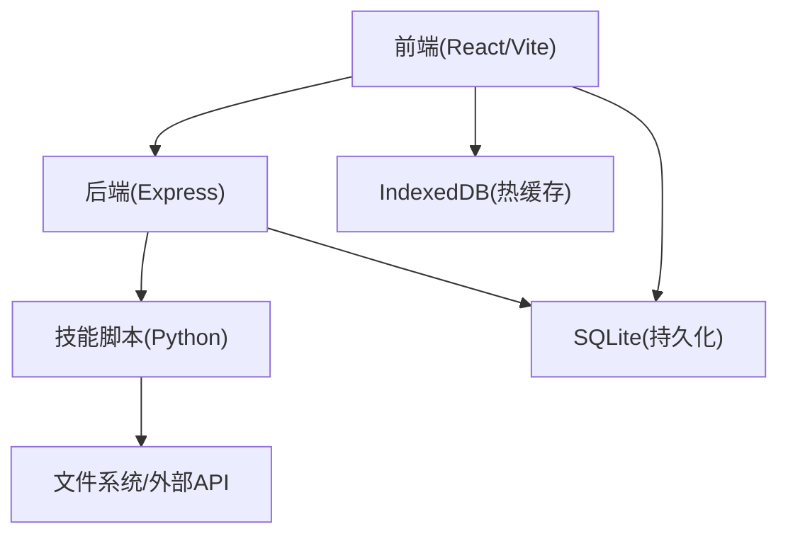
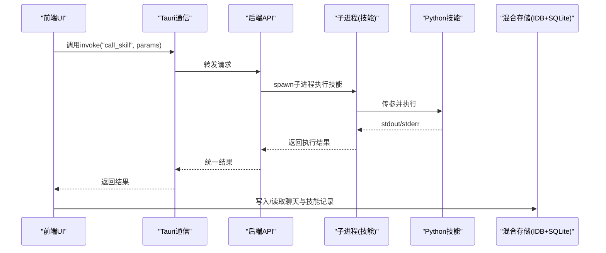
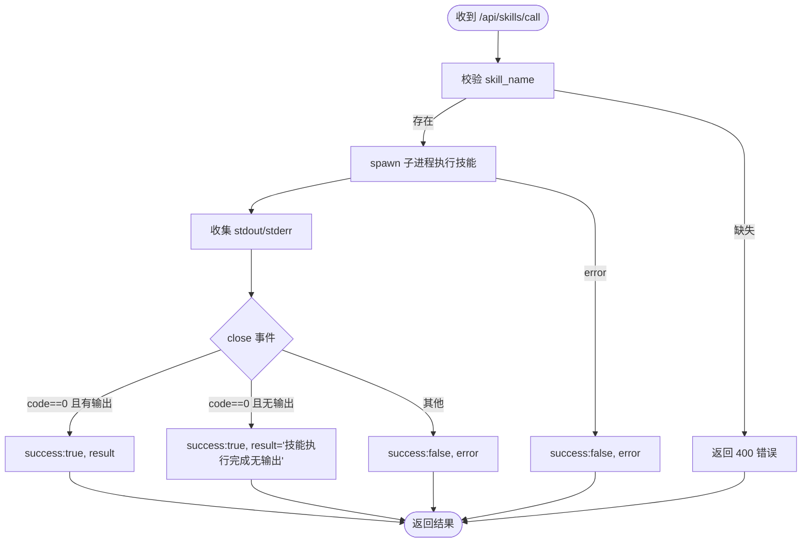
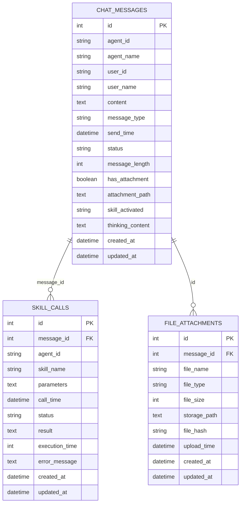
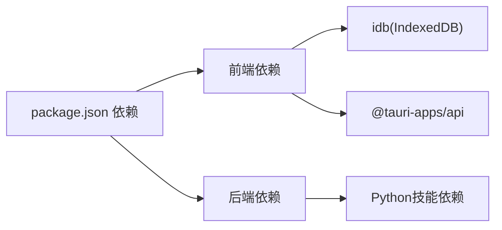

# 监控与维护

<cite>
**本文引用的文件**
- [package.json](file://package.json)
- [backend/index.js](file://backend/index.js)
- [docs/非功能设计/可维护性设计.md](file://docs/非功能设计/可维护性设计.md)
- [docs/数据层设计/数据库设计.md](file://docs/数据层设计/数据库设计.md)
- [docs/非功能设计/性能设计.md](file://docs/非功能设计/性能设计.md)
- [docs/接口层设计/Tauri通信接口.md](file://docs/接口层设计/Tauri通信接口.md)
- [src/services/chatHistoryService.ts](file://src/services/chatHistoryService.ts)
- [src/scripts/clearDatabase.ts](file://src/scripts/clearDatabase.ts)
- [config/agents.json](file://config/agents.json)
- [skills/weather_query/main.py](file://skills/weather_query/main.py)
</cite>

## 目录
1. [简介](#简介)
2. [项目结构](#项目结构)
3. [核心组件](#核心组件)
4. [架构总览](#架构总览)
5. [组件详解](#组件详解)
6. [依赖关系分析](#依赖关系分析)
7. [性能考量](#性能考量)
8. [故障排查指南](#故障排查指南)
9. [结论](#结论)
10. [附录](#附录)

## 简介
本指南面向AutoMate系统的运维与开发团队，提供一套系统化的监控与维护策略，覆盖应用性能监控、错误追踪与日志管理、数据库与存储监控、备份与恢复、健康检查与资源监控、告警机制、故障诊断与性能分析、定期维护与版本升级、灾难恢复预案等内容。文档结合仓库现有设计与实现，给出可落地的操作步骤与可视化图示。

## 项目结构
AutoMate采用前后端分离与技能执行子进程相结合的架构：
- 前端基于React/Vite，使用IndexedDB作为本地热缓存，SQLite数据持久化由混合存储策略支撑。
- 后端基于Express，提供技能调用API，并通过子进程调用Python技能脚本。
- 配置与文档完善，涵盖可维护性、性能、数据层设计与接口通信规范。

图表来源
- [backend/index.js](file://backend/index.js#L1-L117)
- [src/services/chatHistoryService.ts](file://src/services/chatHistoryService.ts#L1-L244)
- [docs/数据层设计/数据库设计.md](file://docs/数据层设计/数据库设计.md#L597-L728)

章节来源
- [package.json](file://package.json#L1-L47)
- [backend/index.js](file://backend/index.js#L1-L117)
- [docs/数据层设计/数据库设计.md](file://docs/数据层设计/数据库设计.md#L1-L738)

## 核心组件
- 后端技能服务：接收前端调用，通过子进程执行Python技能脚本，采集标准输出与错误输出，统一返回结构。
- 前端混合存储：IndexedDB用于近期热数据，SQLite用于历史数据；通过索引与时间范围查询优化读取性能。
- 日志与可维护性：前后端均具备日志记录规范与文件轮转策略，便于问题定位与审计。
- 数据库与索引：针对聊天消息、技能调用、文件附件建立复合索引，配合WAL模式提升并发与性能。
- 接口与事件：Tauri通信接口文档定义invoke与事件系统，便于前后端联动与状态通知。

章节来源
- [backend/index.js](file://backend/index.js#L19-L79)
- [src/services/chatHistoryService.ts](file://src/services/chatHistoryService.ts#L37-L85)
- [docs/非功能设计/可维护性设计.md](file://docs/非功能设计/可维护性设计.md#L197-L292)
- [docs/数据层设计/数据库设计.md](file://docs/数据层设计/数据库设计.md#L266-L378)

## 架构总览
下图展示AutoMate监控与维护相关的系统交互：前端通过Tauri与后端通信，后端调用技能脚本，数据落库并由前端从IndexedDB/SQLite读取，同时具备日志与备份恢复能力。

图表来源
- [docs/接口层设计/Tauri通信接口.md](file://docs/接口层设计/Tauri通信接口.md#L25-L61)
- [backend/index.js](file://backend/index.js#L81-L104)
- [skills/weather_query/main.py](file://skills/weather_query/main.py#L116-L139)
- [src/services/chatHistoryService.ts](file://src/services/chatHistoryService.ts#L87-L120)

## 组件详解

### 后端技能服务与错误追踪
- 请求入口：POST /api/skills/call，校验skill_name必填，调用executeSkill。
- 执行流程：spawn子进程运行Python脚本，捕获stdout/stderr，依据退出码与输出返回success/error。
- 错误处理：对子进程error与close事件分别处理，统一返回结构，便于前端消费。
- 日志记录：后端对请求、执行结果与异常进行控制台日志输出，便于快速定位问题。

图表来源
- [backend/index.js](file://backend/index.js#L81-L104)
- [backend/index.js](file://backend/index.js#L19-L79)

章节来源
- [backend/index.js](file://backend/index.js#L19-L104)

### 前端混合存储与索引设计
- IndexedDB：对象存储chat_messages与skill_calls，建立多维索引（按agent、按时间、按消息ID等），支持快速查询与排序。
- SQLite：作为持久化主存储，承担历史数据与跨会话数据；与IndexedDB通过“写入SQLite、异步写入IndexedDB”的策略协同。
- 时间窗口：默认保留最近24小时的热数据，超出范围自动淘汰，保证性能与容量平衡。

图表来源
- [docs/数据层设计/数据库设计.md](file://docs/数据层设计/数据库设计.md#L41-L264)
- [src/services/chatHistoryService.ts](file://src/services/chatHistoryService.ts#L37-L57)

章节来源
- [src/services/chatHistoryService.ts](file://src/services/chatHistoryService.ts#L37-L244)
- [docs/数据层设计/数据库设计.md](file://docs/数据层设计/数据库设计.md#L266-L378)

### 日志管理与可维护性
- 日志级别：DEBUG/INFO/WARNING/ERROR/CRITICAL，按场景使用。
- 日志格式：统一时间戳、模块名、级别、消息，便于检索与聚合。
- 日志文件：支持RotatingFileHandler按大小轮转，限制备份数量。
- 前端日志：使用console记录调用前后信息，配合错误捕获与重试提示。
- 后端日志：在关键路径（请求进入/离开、技能执行、异常）输出日志。

章节来源
- [docs/非功能设计/可维护性设计.md](file://docs/非功能设计/可维护性设计.md#L197-L292)

### 数据库监控与维护
- 初始化与参数：启用外键、WAL模式、同步模式、缓存大小，提升并发与可靠性。
- 索引策略：为高频查询字段建立单列与复合索引，减少全表扫描。
- 维护任务：定期执行VACUUM与ANALYZE，优化存储与查询计划。
- 备份与恢复：提供数据库文件复制备份与恢复流程，支持加密数据库（SQLCipher）与权限控制。
- 性能监控：EXPLAIN QUERY PLAN分析慢查询，监控数据库大小与增长趋势。

章节来源
- [docs/数据层设计/数据库设计.md](file://docs/数据层设计/数据库设计.md#L21-L37)
- [docs/数据层设计/数据库设计.md](file://docs/数据层设计/数据库设计.md#L473-L516)
- [docs/数据层设计/数据库设计.md](file://docs/数据层设计/数据库设计.md#L568-L595)

### 接口与事件系统
- invoke API：前端通过invoke调用后端函数，后端返回结构化结果；参数校验与权限控制可按接口文档扩展。
- 事件系统：后端可向前端推送智能体状态、消息状态、技能调用等事件，前端监听并更新UI。
- 调试与错误追踪：前后端均记录调用日志与错误堆栈，便于定位问题。

章节来源
- [docs/接口层设计/Tauri通信接口.md](file://docs/接口层设计/Tauri通信接口.md#L25-L61)
- [docs/接口层设计/Tauri通信接口.md](file://docs/接口层设计/Tauri通信接口.md#L545-L664)
- [docs/接口层设计/Tauri通信接口.md](file://docs/接口层设计/Tauri通信接口.md#L936-L1006)

### 技能执行与参数传递
- 后端接收前端请求，拼接Python脚本路径与参数，通过子进程执行。
- Python技能脚本解析命令行参数（--params JSON），执行业务逻辑并打印结果。
- 前端可基于此模式扩展更多技能，统一参数格式与返回约定。

章节来源
- [backend/index.js](file://backend/index.js#L19-L36)
- [skills/weather_query/main.py](file://skills/weather_query/main.py#L116-L139)

## 依赖关系分析
- 前端依赖：React、idb、zustand、@tauri-apps/api等，用于UI、IndexedDB访问与Tauri通信。
- 后端依赖：express、cors、child_process等，提供HTTP服务与子进程管理。
- 技能依赖：Python requests等第三方库，用于外部API调用与数据处理。

图表来源
- [package.json](file://package.json#L15-L26)
- [backend/index.js](file://backend/index.js#L1-L6)

章节来源
- [package.json](file://package.json#L1-L47)
- [backend/index.js](file://backend/index.js#L1-L16)

## 性能考量
- 前端性能：使用Performance API、React DevTools Profiler、Lighthouse等工具进行性能分析与优化。
- 后端性能：使用Python cProfile、Py-Spy、Memory Profiler等工具定位热点与内存问题。
- 数据库性能：建立复合索引、启用WAL、定期VACUUM/ANALYZE、监控查询计划与数据库大小。
- 网络与资源：减少HTTP请求数量、启用缓存与压缩、合理使用WebSocket。

章节来源
- [docs/非功能设计/性能设计.md](file://docs/非功能设计/性能设计.md#L174-L229)
- [docs/数据层设计/数据库设计.md](file://docs/数据层设计/数据库设计.md#L473-L516)

## 故障排查指南

### 常见问题与定位步骤
- 技能执行失败
  - 检查后端日志：确认skill_name是否正确、子进程是否正常退出。
  - 检查Python脚本：查看stderr输出与异常堆栈，确认外部API可达与参数合法。
  - 建议：在后端对stderr进行结构化返回，前端展示具体错误信息。
- 前端无法读取历史数据
  - 检查IndexedDB是否存在、索引是否创建成功。
  - 检查时间范围参数与数据同步策略，确认数据是否已从SQLite同步至IndexedDB。
- 数据库异常
  - 执行VACUUM与ANALYZE，重建缺失索引。
  - 检查数据库文件权限与加密密钥（如启用SQLCipher）。

章节来源
- [backend/index.js](file://backend/index.js#L71-L77)
- [skills/weather_query/main.py](file://skills/weather_query/main.py#L83-L97)
- [src/services/chatHistoryService.ts](file://src/services/chatHistoryService.ts#L61-L85)
- [docs/数据层设计/数据库设计.md](file://docs/数据层设计/数据库设计.md#L473-L516)

### 清理与重置
- 清理混合存储：可通过控制台脚本清空IndexedDB与SQLite数据残留，适用于开发调试与环境重置。
- 注意：清理后需重新初始化数据库与同步策略。

章节来源
- [src/scripts/clearDatabase.ts](file://src/scripts/clearDatabase.ts#L1-L41)

## 结论
AutoMate的监控与维护体系围绕“日志可观测、数据库可优化、存储可治理、技能可追踪”展开。通过明确的流程与工具链，团队可以持续保障系统稳定性、性能与可维护性。建议在生产环境中进一步引入集中式日志与指标采集、自动化备份与恢复演练、以及基于阈值的告警机制。

## 附录

### 健康检查清单
- 日志：前后端日志级别与格式一致，文件轮转配置生效。
- 数据库：WAL模式开启、索引完整、定期维护任务执行。
- 存储：混合存储策略运行正常，热数据淘汰与同步机制有效。
- 技能：技能脚本参数校验与错误返回标准化，后端统一处理。
- 接口：Tauri通信接口文档与实现一致，事件系统可用。

章节来源
- [docs/非功能设计/可维护性设计.md](file://docs/非功能设计/可维护性设计.md#L470-L484)
- [docs/数据层设计/数据库设计.md](file://docs/数据层设计/数据库设计.md#L518-L566)
- [docs/接口层设计/Tauri通信接口.md](file://docs/接口层设计/Tauri通信接口.md#L875-L910)