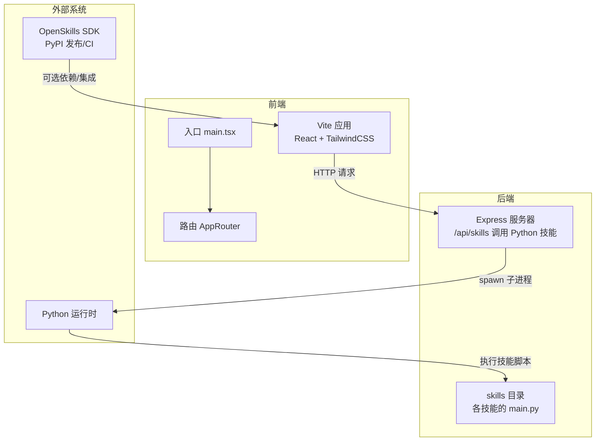
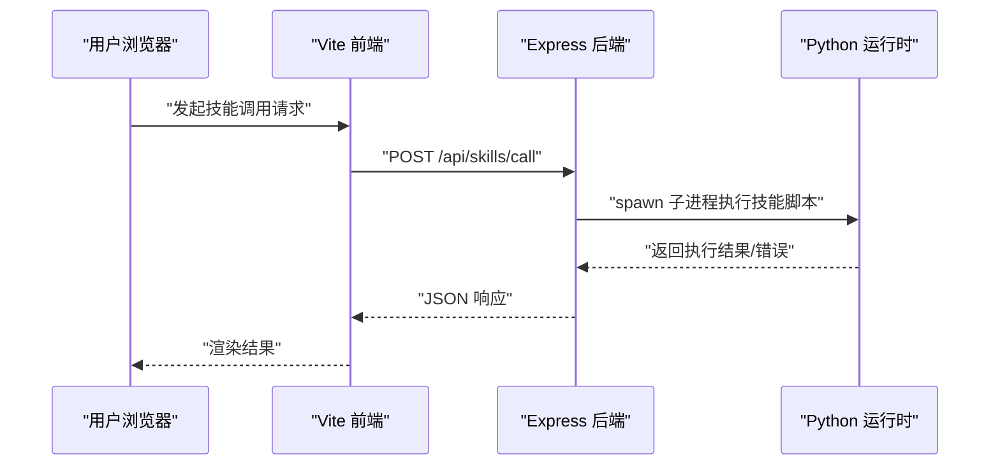
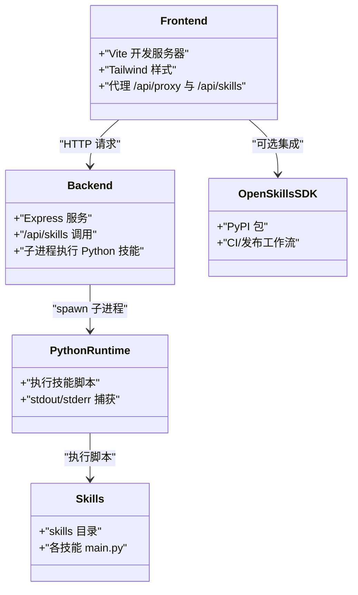
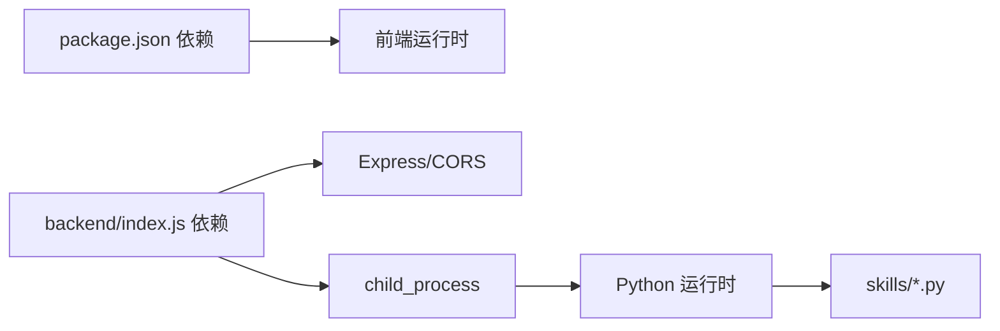

# 部署指南

<cite>
**本文引用的文件**
- [package.json](file://package.json)
- [vite.config.ts](file://vite.config.ts)
- [tailwind.config.ts](file://tailwind.config.ts)
- [backend/index.js](file://backend/index.js)
- [src/main.tsx](file://src/main.tsx)
- [OpenSkills/pyproject.toml](file://OpenSkills-main/pyproject.toml)
- [OpenSkills/.github/workflows/ci.yml](file://OpenSkills-main/.github/workflows/ci.yml)
- [OpenSkills/.github/workflows/publish.yml](file://OpenSkills-main/.github/workflows/publish.yml)
</cite>

## 目录
1. [简介](#简介)
2. [项目结构](#项目结构)
3. [核心组件](#核心组件)
4. [架构总览](#架构总览)
5. [详细组件分析](#详细组件分析)
6. [依赖关系分析](#依赖关系分析)
7. [性能考虑](#性能考虑)
8. [故障排除指南](#故障排除指南)
9. [结论](#结论)
10. [附录](#附录)

## 简介
本部署指南面向AutoMate项目的开发与运维团队，覆盖从开发环境搭建、生产环境配置、桌面应用打包与Tauri构建、平台适配策略，到CI/CD流水线、自动化测试与发布流程。同时提供Docker容器化思路、云服务与负载均衡建议、性能监控与日志管理、安全配置与访问控制、以及回滚与灾难恢复的最佳实践。

## 项目结构
AutoMate采用前后端分离架构：前端基于React + Vite + TailwindCSS，后端使用Node.js + Express提供技能调用代理；技能脚本以Python实现并通过子进程方式在后端执行。OpenSkills作为可选的技能框架与SDK，提供独立的CI/CD与发布流程。

图表来源
- [src/main.tsx](file://src/main.tsx#L1-L12)
- [vite.config.ts](file://vite.config.ts#L1-L47)
- [backend/index.js](file://backend/index.js#L1-L117)
- [OpenSkills/pyproject.toml](file://OpenSkills-main/pyproject.toml#L1-L75)

章节来源
- [package.json](file://package.json#L1-L47)
- [vite.config.ts](file://vite.config.ts#L1-L47)
- [tailwind.config.ts](file://tailwind.config.ts#L1-L161)
- [backend/index.js](file://backend/index.js#L1-L117)
- [src/main.tsx](file://src/main.tsx#L1-L12)

## 核心组件
- 前端开发与构建
  - 使用Vite进行开发与打包，配置了本地代理、分包策略与源码映射。
  - TailwindCSS用于样式体系，支持深色模式与动画类。
- 后端服务
  - Express提供REST接口，负责接收前端请求并调用Python技能脚本。
  - 技能调用通过子进程执行，支持参数传递与标准输出/错误捕获。
- 技能框架（可选）
  - OpenSkills提供技能SDK与CLI，具备独立的CI/CD与PyPI发布流程。

章节来源
- [package.json](file://package.json#L6-L14)
- [vite.config.ts](file://vite.config.ts#L12-L46)
- [tailwind.config.ts](file://tailwind.config.ts#L8-L16)
- [backend/index.js](file://backend/index.js#L19-L79)
- [OpenSkills/pyproject.toml](file://OpenSkills-main/pyproject.toml#L1-L75)

## 架构总览
前端通过Vite本地代理转发至后端，后端再调用Python技能脚本执行具体任务。OpenSkills作为可选能力，可通过pip安装并在需要时集成。

图表来源
- [vite.config.ts](file://vite.config.ts#L18-L29)
- [backend/index.js](file://backend/index.js#L81-L104)

## 详细组件分析

### 前端开发与构建（Vite + React + TailwindCSS）
- 开发与预览
  - 开发服务器端口为3000，自动打开浏览器。
  - 通过代理将/api/proxy与/api/skills转发至外部网关与后端。
- 构建优化
  - 分包策略将常用依赖拆分为独立chunk，提升缓存命中率。
  - 启用SourceMap便于生产调试。
- 样式体系
  - TailwindCSS启用深色模式与丰富的动画类，满足主题切换与交互反馈。

章节来源
- [vite.config.ts](file://vite.config.ts#L12-L46)
- [tailwind.config.ts](file://tailwind.config.ts#L8-L16)
- [tailwind.config.ts](file://tailwind.config.ts#L98-L146)

### 后端服务（Express + 子进程技能执行）
- 接口设计
  - GET /api/skills：健康检查。
  - POST /api/skills/call：调用指定技能，支持参数传递。
- 执行机制
  - 通过子进程spawn执行Python脚本，捕获stdout/stderr与退出码。
  - 对成功与失败场景分别返回结构化的响应。
- 安全与健壮性
  - 明确校验skill_name参数，缺失时返回400。
  - 异常捕获与错误信息标准化，避免敏感堆栈泄露。

章节来源
- [backend/index.js](file://backend/index.js#L106-L111)
- [backend/index.js](file://backend/index.js#L81-L104)
- [backend/index.js](file://backend/index.js#L19-L79)

### 技能框架（OpenSkills SDK）
- 版本与依赖
  - Python >= 3.10，核心依赖包括pyyaml、pydantic、typer等。
- CI/CD
  - CI工作流对Python代码进行格式与静态检查。
  - 发布工作流构建wheel/sdist，上传至PyPI，并创建GitHub Release。
- 集成建议
  - 在需要时通过pip安装OpenSkills SDK，复用其CLI与工具链。

章节来源
- [OpenSkills/pyproject.toml](file://OpenSkills-main/pyproject.toml#L1-L75)
- [OpenSkills/.github/workflows/ci.yml](file://OpenSkills-main/.github/workflows/ci.yml#L1-L32)
- [OpenSkills/.github/workflows/publish.yml](file://OpenSkills-main/.github/workflows/publish.yml#L1-L99)

### 组件关系图（代码级）

图表来源
- [vite.config.ts](file://vite.config.ts#L18-L29)
- [backend/index.js](file://backend/index.js#L19-L79)
- [OpenSkills/pyproject.toml](file://OpenSkills-main/pyproject.toml#L1-L75)

## 依赖关系分析
- 前端依赖
  - React生态、TailwindCSS、Axios、Zustand等，支撑UI与状态管理。
- 后端依赖
  - Express、CORS、child_process用于技能执行。
- 技能执行链路
  - 前端 -> 后端 -> Python子进程 -> 技能脚本。

图表来源
- [package.json](file://package.json#L15-L27)
- [backend/index.js](file://backend/index.js#L1-L6)

章节来源
- [package.json](file://package.json#L15-L27)
- [backend/index.js](file://backend/index.js#L1-L6)

## 性能考虑
- 构建优化
  - 利用Vite的分包策略减少首屏体积，结合SourceMap便于问题定位。
  - TailwindCSS按需引入与摇树优化，避免未使用样式进入产物。
- 网络与代理
  - 本地代理减少跨域与反向代理复杂度；生产环境建议统一由网关或反向代理处理。
- Python执行
  - 子进程执行技能可能带来阻塞风险，建议在后端增加超时与并发限制，必要时引入队列与异步化。

章节来源
- [vite.config.ts](file://vite.config.ts#L32-L46)
- [tailwind.config.ts](file://tailwind.config.ts#L4-L7)
- [backend/index.js](file://backend/index.js#L19-L79)

## 故障排除指南
- 常见问题
  - 技能调用失败：检查skill_name是否正确、技能脚本是否存在、Python运行时是否可用。
  - CORS错误：确认后端已启用CORS中间件，代理配置正确。
  - 子进程无输出：检查脚本编码与stdout/stderr输出，确保UTF-8环境变量设置。
- 日志与监控
  - 后端打印技能执行日志，建议接入集中式日志（如ELK/Cloud Logging）与指标采集（如Prometheus/Grafana）。
- 回滚与恢复
  - 采用蓝绿/滚动发布策略，保留上一版本镜像/包；出现异常时快速回滚。
  - 备份技能脚本与配置，定期演练灾难恢复流程。

章节来源
- [backend/index.js](file://backend/index.js#L81-L104)
- [backend/index.js](file://backend/index.js#L19-L79)

## 结论
AutoMate的部署以“前端Vite + 后端Express + Python技能脚本”为核心，具备清晰的职责边界与可扩展性。通过合理的CI/CD、容器化与云服务编排，可实现稳定高效的交付与运维。建议在生产环境中强化安全与可观测性，并制定完善的回滚与灾备策略。

## 附录

### 开发环境搭建
- 前端
  - 安装Node.js与包管理器，执行依赖安装与启动脚本。
  - 开发服务器默认端口3000，自动打开浏览器。
- 后端
  - 安装Node.js依赖，启动Express服务，默认端口3001。
  - 确保Python运行时可用，技能脚本位于skills目录。
- 可选：安装OpenSkills SDK以便使用其CLI与工具链。

章节来源
- [package.json](file://package.json#L6-L14)
- [backend/index.js](file://backend/index.js#L113-L116)

### 生产环境配置
- 端口与网络
  - 前端：对外暴露Vite构建产物；后端：对外暴露3001端口。
  - 生产代理建议由Nginx/HAProxy统一处理跨域与TLS终止。
- 安全加固
  - 仅允许受信IP访问后端；启用HTTPS与强密码策略。
  - 对外开放的API需鉴权与限流，记录审计日志。
- 监控与日志
  - 集中式日志与告警；关键指标埋点（QPS、延迟、错误率、技能执行耗时）。

章节来源
- [vite.config.ts](file://vite.config.ts#L12-L18)
- [backend/index.js](file://backend/index.js#L14-L15)

### 桌面应用打包与Tauri构建
- 当前仓库未包含Tauri相关配置文件，若计划打包为桌面应用，建议：
  - 在现有前端基础上，新增Tauri项目结构与配置。
  - 将后端服务内嵌或通过本地代理连接，确保技能脚本在桌面环境下可执行。
  - 平台适配：Windows/macOS/Linux分别配置签名、沙箱与权限。
  - 自动化：在CI中生成多平台安装包并上传制品库。

章节来源
- [src/main.tsx](file://src/main.tsx#L1-L12)
- [vite.config.ts](file://vite.config.ts#L1-L47)

### CI/CD流水线与发布
- 前端/后端
  - 使用Vite构建，生成dist产物；后端可直接部署Node运行时。
- 技能框架（OpenSkills）
  - CI：Ruff格式与静态检查；发布：构建wheel/sdist并发布至PyPI，创建GitHub Release。
- 自动化测试
  - 建议在CI中加入前端单元测试、后端接口测试与技能脚本集成测试。

章节来源
- [OpenSkills/.github/workflows/ci.yml](file://OpenSkills-main/.github/workflows/ci.yml#L1-L32)
- [OpenSkills/.github/workflows/publish.yml](file://OpenSkills-main/.github/workflows/publish.yml#L1-L99)

### Docker容器化与云服务
- 容器化
  - 前端：Nginx静态托管dist；后端：Node运行时镜像；Python：Alpine+依赖。
  - 建议使用多阶段构建减小镜像体积。
- 云服务
  - 前端与后端分别部署于容器服务；数据库与存储独立管理。
  - 负载均衡：Nginx/ALB前置，后端水平扩展；后端可使用PM2或集群模式。
- 环境隔离
  - 开发/测试/生产三套环境，配置文件与密钥分离。

章节来源
- [package.json](file://package.json#L6-L14)
- [backend/index.js](file://backend/index.js#L113-L116)

### 安全配置与访问控制
- 认证与授权
  - 对外API接入统一认证（如JWT/OAuth），内部服务间通过私有网络与服务网格。
- 密钥与证书
  - 使用密钥管理服务（如KMS/Vault）管理证书与API密钥；TLS证书由可信CA签发。
- 输入校验与防护
  - 对技能参数进行白名单校验，防止命令注入；限制子进程资源占用与执行时间。

章节来源
- [backend/index.js](file://backend/index.js#L81-L104)
- [backend/index.js](file://backend/index.js#L19-L79)

### 回滚策略与灾难恢复
- 回滚
  - 采用蓝绿/金丝雀发布，保留上一版本镜像；异常时一键回滚。
- 灾难恢复
  - 定期备份技能脚本、配置与数据；演练RTO/RPO目标；多可用区部署。
- 运维最佳实践
  - 变更评审、灰度发布、变更窗口与紧急预案；建立值班与应急响应流程。

章节来源
- [OpenSkills/.github/workflows/publish.yml](file://OpenSkills-main/.github/workflows/publish.yml#L56-L99)