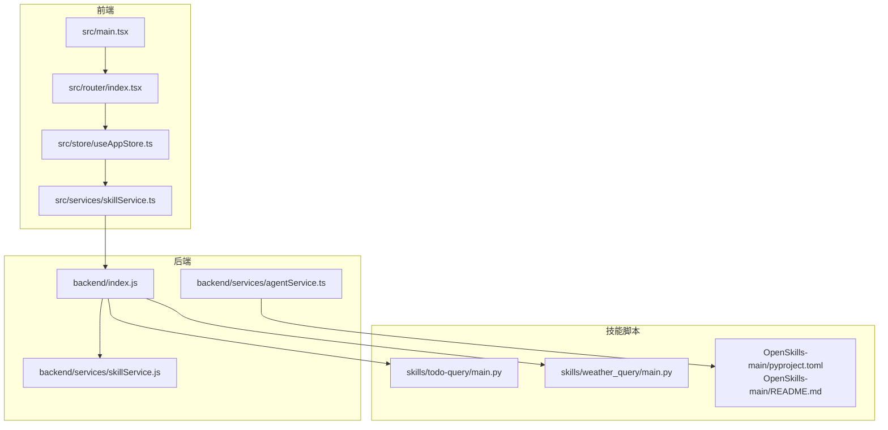
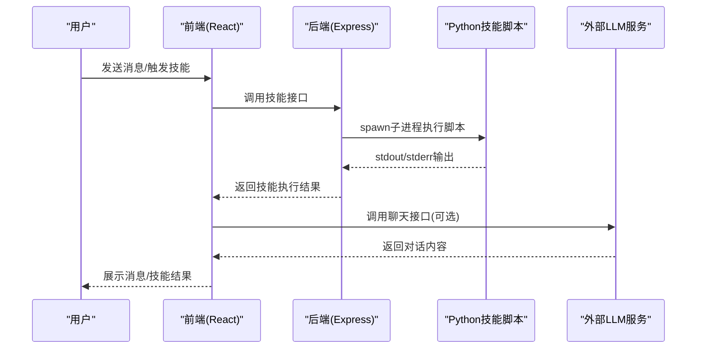
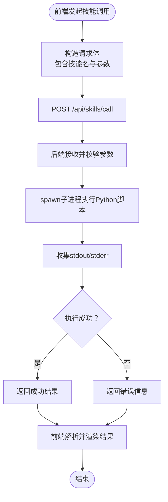
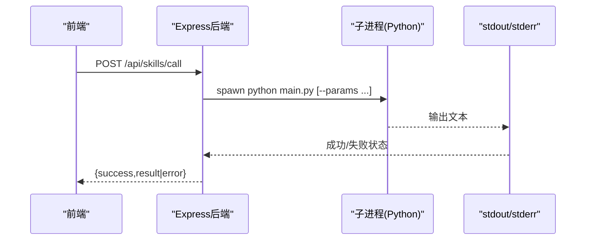
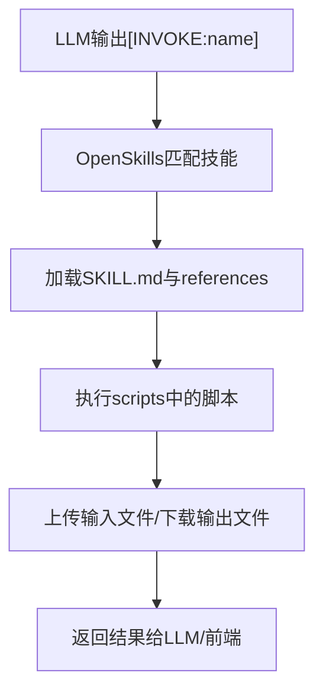
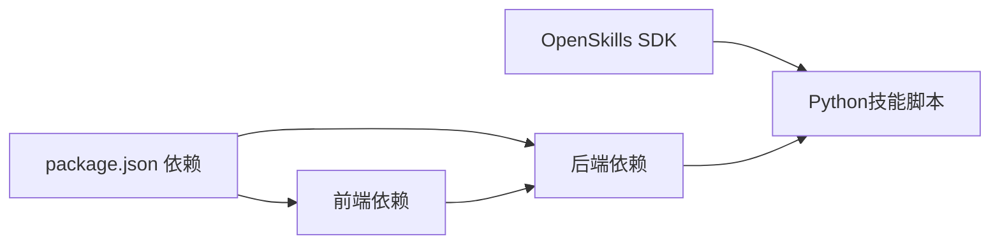

# 技术栈概览

<cite>
**本文引用的文件**
- [package.json](file://package.json)
- [tsconfig.json](file://tsconfig.json)
- [tailwind.config.ts](file://tailwind.config.ts)
- [vite.config.ts](file://vite.config.ts)
- [backend/index.js](file://backend/index.js)
- [backend/services/skillService.js](file://backend/services/skillService.js)
- [backend/services/agentService.ts](file://backend/services/agentService.ts)
- [src/main.tsx](file://src/main.tsx)
- [src/router/index.tsx](file://src/router/index.tsx)
- [src/store/useAppStore.ts](file://src/store/useAppStore.ts)
- [src/services/skillService.ts](file://src/services/skillService.ts)
- [config/agents.json](file://config/agents.json)
- [skills/todo-query/main.py](file://skills/todo-query/main.py)
- [skills/weather_query/main.py](file://skills/weather_query/main.py)
- [OpenSkills-main/pyproject.toml](file://OpenSkills-main/pyproject.toml)
- [OpenSkills-main/README.md](file://OpenSkills-main/README.md)
- [docs/技术架构/后端技术栈.md](file://docs/技术架构/后端技术栈.md)
</cite>

## 目录
1. [引言](#引言)
2. [项目结构](#项目结构)
3. [核心组件](#核心组件)
4. [架构总览](#架构总览)
5. [详细组件分析](#详细组件分析)
6. [依赖关系分析](#依赖关系分析)
7. [性能考量](#性能考量)
8. [故障排查指南](#故障排查指南)
9. [结论](#结论)
10. [附录](#附录)

## 引言
本技术栈概览面向AutoMate项目，系统梳理前端（React 18.3.1、TypeScript、Tailwind CSS）、后端（Node.js、Express）、桌面应用框架（Tauri，仓库中以Vite为开发工具体现其跨平台能力）、以及Python技能脚本系统（OpenSkills生态）的整体搭配与协作方式。文档解释每项技术的选择原因、优势及在项目中的具体职责，并给出整体架构如何平衡性能、开发效率与用户体验，最后提供学习路径与参考资料。

## 项目结构
AutoMate采用前后端分离与“技能脚本”解耦的设计：前端通过Vite+React+TS构建UI与交互；后端以Express提供技能调用与代理接口；技能脚本以Python实现，通过后端子进程调用；同时利用OpenSkills SDK对技能进行结构化管理与沙箱执行（仓库包含该SDK源码与示例）。下图展示主要技术与模块的关系：

图表来源
- [src/main.tsx](file://src/main.tsx#L1-L12)
- [src/router/index.tsx](file://src/router/index.tsx#L1-L43)
- [src/store/useAppStore.ts](file://src/store/useAppStore.ts#L1-L306)
- [src/services/skillService.ts](file://src/services/skillService.ts#L1-L73)
- [backend/index.js](file://backend/index.js#L1-L117)
- [backend/services/agentService.ts](file://backend/services/agentService.ts#L1-L245)
- [backend/services/skillService.js](file://backend/services/skillService.js#L1-L87)
- [skills/todo-query/main.py](file://skills/todo-query/main.py#L1-L34)
- [skills/weather_query/main.py](file://skills/weather_query/main.py#L1-L139)
- [OpenSkills-main/pyproject.toml](file://OpenSkills-main/pyproject.toml#L1-L75)
- [OpenSkills-main/README.md](file://OpenSkills-main/README.md#L1-L411)

章节来源
- [package.json](file://package.json#L1-L47)
- [vite.config.ts](file://vite.config.ts#L1-L47)
- [tailwind.config.ts](file://tailwind.config.ts#L1-L161)
- [tsconfig.json](file://tsconfig.json#L1-L26)

## 核心组件
- 前端技术栈
  - React 18.3.1：组件化UI与高效渲染。
  - TypeScript：类型安全与更好的开发体验。
  - Tailwind CSS：原子化样式与主题定制。
  - Vite：快速开发与构建，含代理与分包策略。
- 后端技术栈
  - Node.js + Express：轻量Web服务，提供技能调用与代理。
  - 子进程调用Python脚本：通过spawn执行技能脚本，收集stdout/stderr。
- 桌面应用框架
  - Tauri：仓库中以Vite为开发工具体现跨平台桌面能力，结合Rust后端实现原生窗口与系统集成。
- Python技能脚本系统
  - OpenSkills SDK：技能三层渐进披露架构、脚本自动发现与沙箱执行。
  - 技能脚本：以main.py为主入口，接收参数并通过命令行传参或stdin注入。

章节来源
- [package.json](file://package.json#L15-L45)
- [backend/index.js](file://backend/index.js#L19-L79)
- [OpenSkills-main/pyproject.toml](file://OpenSkills-main/pyproject.toml#L22-L28)

## 架构总览
AutoMate采用“前端-后端-技能脚本”的分层架构：
- 前端负责用户界面、状态管理与API调用；
- 后端负责技能编排、LLM对接与脚本执行；
- 技能脚本负责具体业务逻辑与外部服务调用；
- OpenSkills提供技能标准化与沙箱执行能力。

图表来源
- [src/services/skillService.ts](file://src/services/skillService.ts#L12-L61)
- [backend/index.js](file://backend/index.js#L81-L104)
- [backend/services/skillService.js](file://backend/services/skillService.js#L16-L71)
- [skills/todo-query/main.py](file://skills/todo-query/main.py#L23-L34)
- [skills/weather_query/main.py](file://skills/weather_query/main.py#L128-L139)

## 详细组件分析

### 前端组件分析
- 入口与路由
  - 应用入口通过React DOM挂载根组件，引入全局样式与Tailwind样式。
  - 路由采用React Router，提供欢迎页、智能体聊天页与设置页。
- 状态管理
  - 使用Zustand集中管理代理列表、聊天消息、主题与用户设置，支持消息增删改、打字态与主题切换。
- 样式与主题
  - Tailwind配置自定义颜色、字体、动画与响应式断点，支持明暗主题切换。
- 技能调用
  - 前端通过Axios向后端发起技能调用请求，统一处理超时、网络错误与业务错误。

图表来源
- [src/services/skillService.ts](file://src/services/skillService.ts#L12-L61)
- [backend/index.js](file://backend/index.js#L19-L79)
- [backend/services/skillService.js](file://backend/services/skillService.js#L16-L71)

章节来源
- [src/main.tsx](file://src/main.tsx#L1-L12)
- [src/router/index.tsx](file://src/router/index.tsx#L1-L43)
- [src/store/useAppStore.ts](file://src/store/useAppStore.ts#L1-L306)
- [tailwind.config.ts](file://tailwind.config.ts#L1-L161)
- [vite.config.ts](file://vite.config.ts#L12-L46)

### 后端组件分析
- Express服务
  - 提供CORS支持与JSON解析；暴露技能调用与健康检查接口；内置代理规则转发至外部模型网关。
- 技能执行
  - 通过子进程调用Python脚本，支持参数传递与编码控制；捕获标准输出与错误输出，统一返回结构。
- 代理与LLM对接
  - 代理转发至本地或远端模型网关；智能体服务封装LLM调用，构建系统提示词并处理错误。

图表来源
- [backend/index.js](file://backend/index.js#L19-L79)
- [backend/services/skillService.js](file://backend/services/skillService.js#L16-L71)

章节来源
- [backend/index.js](file://backend/index.js#L1-L117)
- [backend/services/skillService.js](file://backend/services/skillService.js#L1-L87)
- [backend/services/agentService.ts](file://backend/services/agentService.ts#L1-L245)
- [vite.config.ts](file://vite.config.ts#L18-L29)

### Python技能脚本系统
- 技能结构
  - 每个技能包含SKILL.md（描述与触发词）、references/（参考文档）与scripts/（可执行脚本）。
- 执行流程
  - 后端通过子进程调用技能的main.py，支持命令行参数传入；脚本内部解析参数并执行业务逻辑，最终打印结果。
- OpenSkills能力
  - 三层渐进披露架构：元数据层（总是加载）、指令层（按需加载）、资源层（条件加载）。
  - 自动发现references目录；脚本可通过[INVOKE:name]触发；支持沙箱执行与文件同步。

图表来源
- [OpenSkills-main/README.md](file://OpenSkills-main/README.md#L204-L269)
- [OpenSkills-main/README.md](file://OpenSkills-main/README.md#L102-L202)

章节来源
- [skills/todo-query/main.py](file://skills/todo-query/main.py#L1-L34)
- [skills/weather_query/main.py](file://skills/weather_query/main.py#L1-L139)
- [OpenSkills-main/pyproject.toml](file://OpenSkills-main/pyproject.toml#L1-L75)
- [OpenSkills-main/README.md](file://OpenSkills-main/README.md#L1-L411)

### 桌面应用框架（Tauri）
- 仓库中以Vite作为开发工具与构建管线，体现跨平台桌面应用能力；结合Rust后端可实现原生窗口、系统托盘、文件系统访问等。
- 与前端React生态无缝衔接，开发体验与性能兼顾。

章节来源
- [package.json](file://package.json#L6-L13)
- [vite.config.ts](file://vite.config.ts#L1-L47)

## 依赖关系分析
- 前端依赖
  - React、React Router、Zustand、Lucide React、React Markdown等构成UI与状态管理基础。
  - Vite提供开发服务器、代理与打包，手动分包策略提升首屏性能。
- 后端依赖
  - Express提供Web服务；CORS支持跨域；child_process用于调用Python脚本。
- Python生态
  - OpenSkills SDK提供技能框架；技能脚本可使用requests等库进行HTTP请求。

图表来源
- [package.json](file://package.json#L15-L45)
- [OpenSkills-main/pyproject.toml](file://OpenSkills-main/pyproject.toml#L22-L28)

章节来源
- [package.json](file://package.json#L1-L47)
- [OpenSkills-main/pyproject.toml](file://OpenSkills-main/pyproject.toml#L1-L75)

## 性能考量
- 前端
  - Vite分包策略将React、路由、状态与UI库拆分为独立chunk，减少初始包体积。
  - Tailwind按需扫描内容，避免未使用类名进入产物。
- 后端
  - 子进程执行Python脚本避免阻塞主线程；代理规则减少跨域与中间层延迟。
- 技能脚本
  - OpenSkills三层架构按需加载，降低内存占用；沙箱执行隔离风险并可缓存依赖。

章节来源
- [vite.config.ts](file://vite.config.ts#L37-L44)
- [tailwind.config.ts](file://tailwind.config.ts#L4-L7)
- [backend/index.js](file://backend/index.js#L18-L29)
- [OpenSkills-main/README.md](file://OpenSkills-main/README.md#L102-L162)

## 故障排查指南
- 技能调用失败
  - 检查后端是否正常运行（npm run backend），确认技能名与参数是否正确。
  - 查看后端日志中stdout/stderr输出，定位Python脚本异常。
- 网络与代理问题
  - 确认Vite代理规则指向正确的目标地址与路径重写规则。
- LLM调用错误
  - 检查代理服务可用性与鉴权头；关注超时与网络错误提示。
- 主题与样式异常
  - 确认Tailwind内容扫描路径与暗色模式开关；检查全局样式导入顺序。

章节来源
- [src/services/skillService.ts](file://src/services/skillService.ts#L34-L61)
- [backend/index.js](file://backend/index.js#L81-L104)
- [vite.config.ts](file://vite.config.ts#L18-L29)
- [tailwind.config.ts](file://tailwind.config.ts#L8-L8)

## 结论
AutoMate的技术栈围绕“前端React+TS+Tailwind + 后端Node.js+Express + Python技能脚本 + OpenSkills SDK”的组合展开。该组合在开发效率（TypeScript类型安全、Vite热更新）、用户体验（Tailwind原子化样式、Zustand状态管理）与系统性能（子进程隔离执行、分包与按需加载）之间取得良好平衡。OpenSkills进一步提升了技能的可维护性与可扩展性，为后续接入更多外部服务与复杂业务场景奠定基础。

## 附录
- 学习路径与参考资料
  - 前端
    - React官方文档、TypeScript官网、Tailwind CSS文档、Vite官方文档
  - 后端
    - Node.js官方文档、Express官方文档、OpenSkills SDK文档
  - 桌面应用
    - Tauri官方文档、Vite跨平台开发指南
  - 项目内参考
    - 后端技术栈文档、技能脚本示例与OpenSkills README

章节来源
- [docs/技术架构/后端技术栈.md](file://docs/技术架构/后端技术栈.md#L374-L380)
- [OpenSkills-main/README.md](file://OpenSkills-main/README.md#L374-L411)