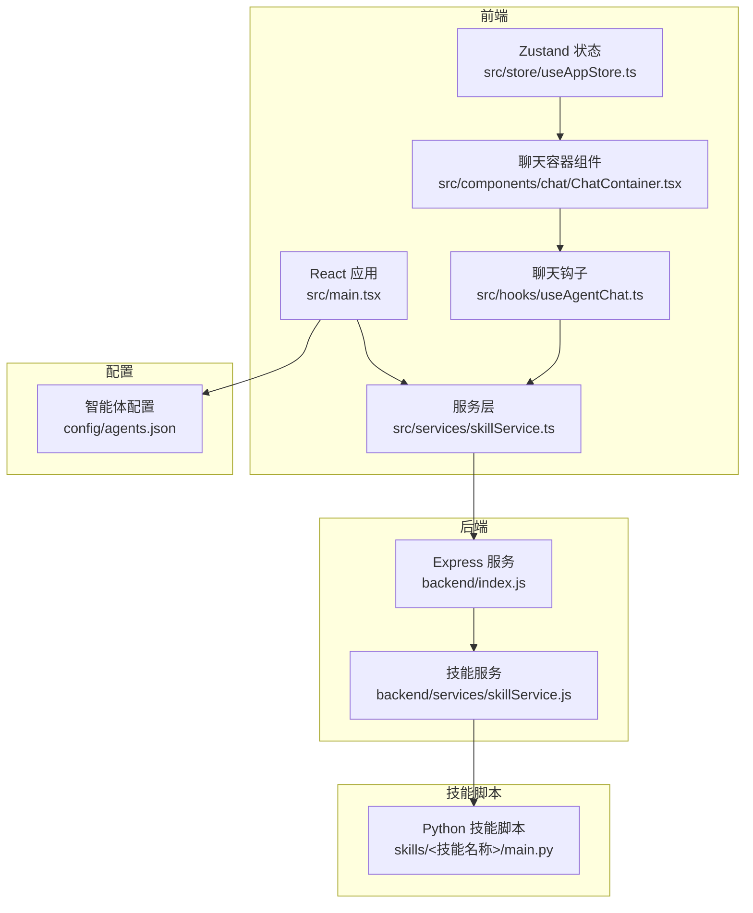
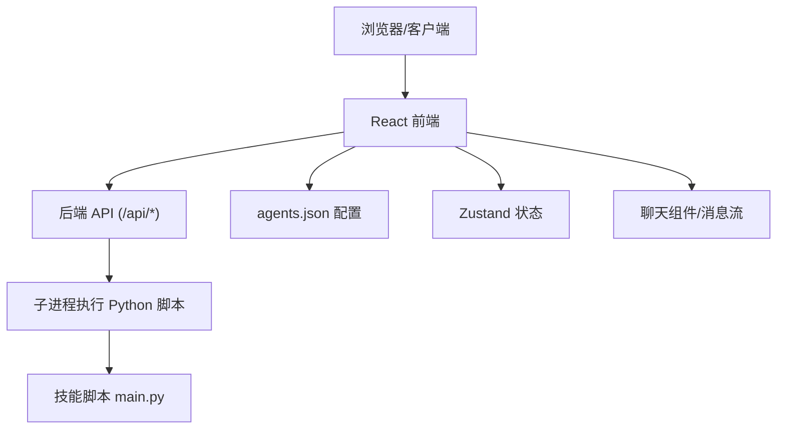
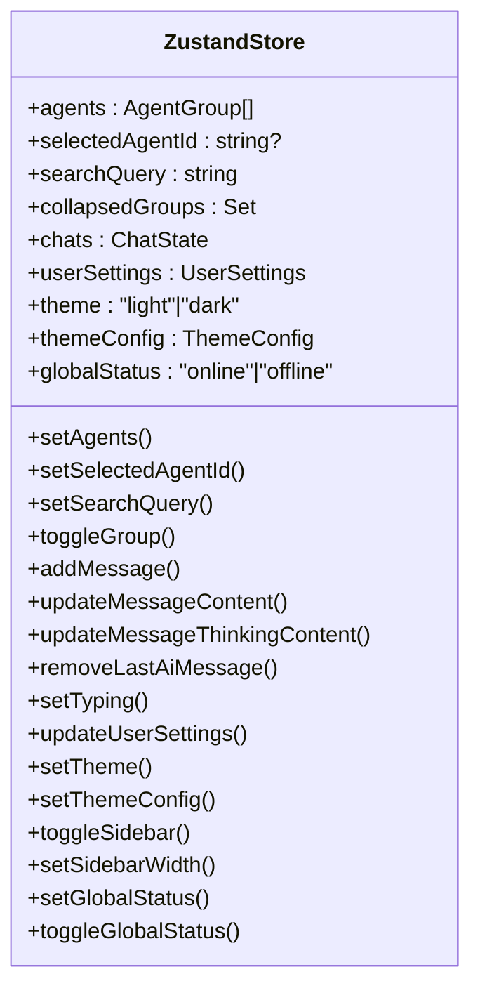
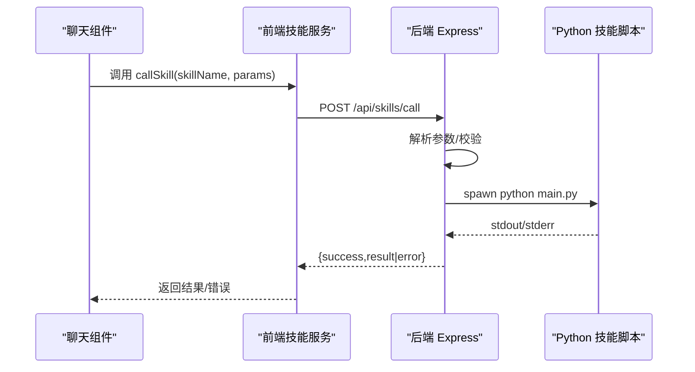
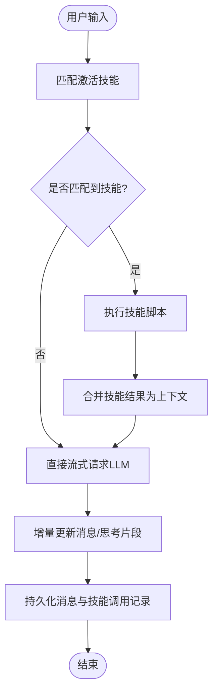
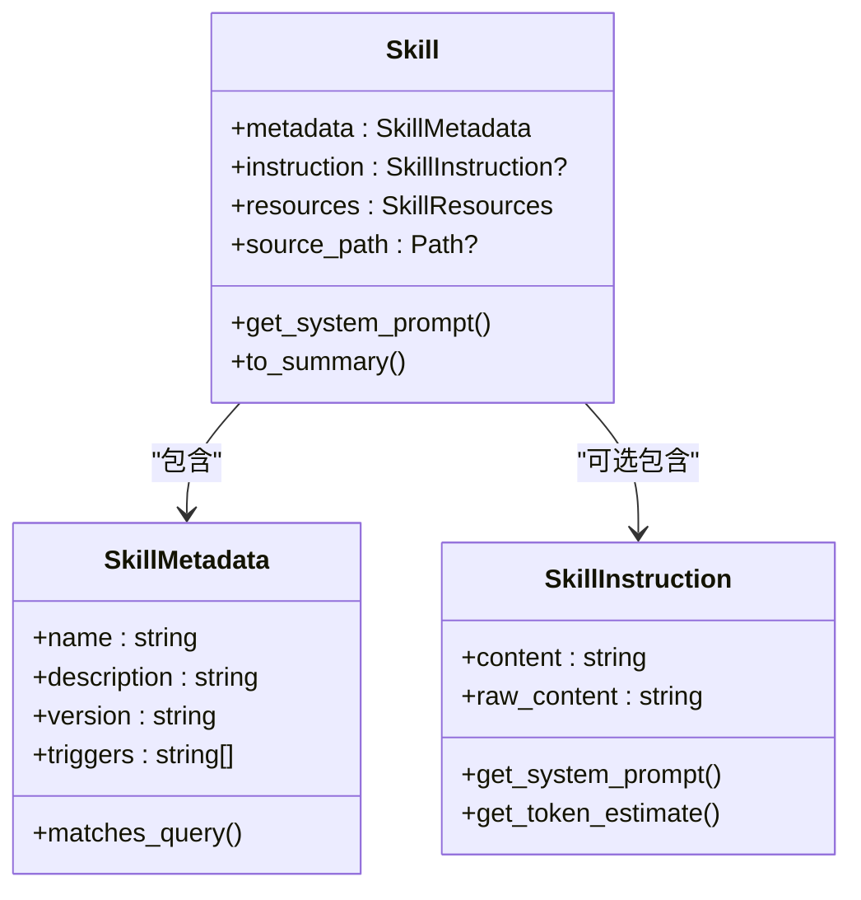
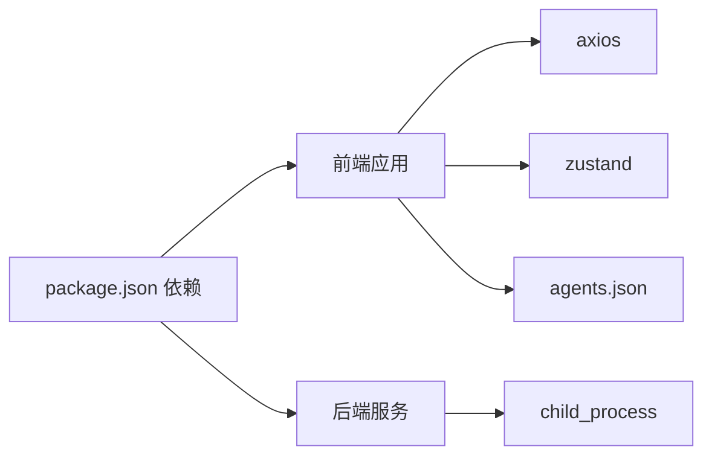

# 架构设计

<cite>
**本文引用的文件**
- [package.json](file://package.json)
- [backend/index.js](file://backend/index.js)
- [src/main.tsx](file://src/main.tsx)
- [config/agents.json](file://config/agents.json)
- [src/store/useAppStore.ts](file://src/store/useAppStore.ts)
- [src/services/skillService.ts](file://src/services/skillService.ts)
- [backend/services/skillService.js](file://backend/services/skillService.js)
- [skills/todo-query/main.py](file://skills/todo-query/main.py)
- [src/hooks/useAgentChat.ts](file://src/hooks/useAgentChat.ts)
- [src/components/chat/ChatContainer.tsx](file://src/components/chat/ChatContainer.tsx)
- [OpenSkills-main/pyproject.toml](file://OpenSkills-main/pyproject.toml)
- [OpenSkills-main/openskills/core/skill.py](file://OpenSkills-main/openskills/core/skill.py)
- [OpenSkills-main/openskills/models/metadata.py](file://OpenSkills-main/openskills/models/metadata.py)
- [OpenSkills-main/openskills/models/instruction.py](file://OpenSkills-main/openskills/models/instruction.py)
</cite>

## 目录
1. [引言](#引言)
2. [项目结构](#项目结构)
3. [核心组件](#核心组件)
4. [架构总览](#架构总览)
5. [详细组件分析](#详细组件分析)
6. [依赖分析](#依赖分析)
7. [性能考量](#性能考量)
8. [故障排查指南](#故障排查指南)
9. [结论](#结论)
10. [附录](#附录)

## 引言
本架构设计文档面向AutoMate项目，系统性阐述其整体架构模式与实现细节，重点覆盖以下方面：
- 分层架构与微服务思想：前端React应用、后端Node.js服务、Python技能脚本、以及可选的桌面应用框架（Tauri）之间的职责划分与交互关系。
- 组件化设计：前端以React Hooks与Zustand状态管理为核心，结合可复用UI组件与服务层封装。
- 插件化架构（技能系统）：通过“技能”作为插件单元，支持动态发现、匹配与执行；同时介绍OpenSkills SDK的三层渐进披露模型。
- 配置驱动设计：通过agents.json集中管理智能体与技能配置，实现低耦合的扩展与运维。

## 项目结构
AutoMate采用前后端分离与技能脚本解耦的组织方式：
- 前端：基于React + TypeScript + Vite构建，使用Zustand进行全局状态管理，组件按功能域拆分，路由与页面清晰分离。
- 后端：Node.js Express服务，提供技能调用API，内部通过子进程调用Python技能脚本。
- 技能系统：独立的Python脚本集合，每个技能以main.py入口执行，参数通过命令行传递。
- 配置：agents.json集中定义智能体、技能与外部模型配置。
- OpenSkills SDK：提供技能的元数据、指令与资源的建模与加载能力，支撑更复杂的技能生命周期管理。

**图示来源**
- [src/main.tsx](file://src/main.tsx#L1-L12)
- [src/store/useAppStore.ts](file://src/store/useAppStore.ts#L1-L306)
- [src/services/skillService.ts](file://src/services/skillService.ts#L1-L73)
- [src/hooks/useAgentChat.ts](file://src/hooks/useAgentChat.ts#L1-L128)
- [src/components/chat/ChatContainer.tsx](file://src/components/chat/ChatContainer.tsx#L1-L756)
- [backend/index.js](file://backend/index.js#L1-L117)
- [backend/services/skillService.js](file://backend/services/skillService.js#L1-L87)
- [skills/todo-query/main.py](file://skills/todo-query/main.py#L1-L34)
- [config/agents.json](file://config/agents.json#L1-L119)

**章节来源**
- [package.json](file://package.json#L1-L47)
- [backend/index.js](file://backend/index.js#L1-L117)
- [src/main.tsx](file://src/main.tsx#L1-L12)
- [config/agents.json](file://config/agents.json#L1-L119)

## 核心组件
- 前端应用入口与路由：React应用通过入口文件挂载根组件，统一引入样式与路由。
- Zustand状态管理：集中管理智能体、聊天会话、主题与用户设置等全局状态，提供高内聚、低耦合的状态操作。
- 技能服务封装：前端通过axios调用后端技能API，统一处理超时、网络与业务错误。
- 后端技能服务：接收前端请求，定位技能脚本路径，通过子进程执行Python脚本，并收集标准输出或错误输出。
- 技能脚本：每个技能以main.py为入口，支持命令行参数解析，返回字符串结果供前端展示。
- 配置驱动：agents.json集中声明智能体、技能与模型配置，前端在初始化时拉取并构建技能字典。

**章节来源**
- [src/main.tsx](file://src/main.tsx#L1-L12)
- [src/store/useAppStore.ts](file://src/store/useAppStore.ts#L1-L306)
- [src/services/skillService.ts](file://src/services/skillService.ts#L1-L73)
- [backend/index.js](file://backend/index.js#L1-L117)
- [backend/services/skillService.js](file://backend/services/skillService.js#L1-L87)
- [skills/todo-query/main.py](file://skills/todo-query/main.py#L1-L34)
- [config/agents.json](file://config/agents.json#L1-L119)

## 架构总览
AutoMate采用“前端React + 后端Node.js + Python技能脚本”的三层架构，并通过配置驱动实现智能体与技能的解耦。前端负责用户交互与状态管理，后端负责技能编排与执行，技能脚本负责具体任务的实现。OpenSkills SDK提供了技能的元数据、指令与资源的建模能力，便于未来向更复杂的技能生命周期管理演进。

**图示来源**
- [backend/index.js](file://backend/index.js#L81-L111)
- [backend/services/skillService.js](file://backend/services/skillService.js#L16-L71)
- [skills/todo-query/main.py](file://skills/todo-query/main.py#L23-L34)
- [src/services/skillService.ts](file://src/services/skillService.ts#L12-L61)
- [config/agents.json](file://config/agents.json#L1-L119)
- [src/store/useAppStore.ts](file://src/store/useAppStore.ts#L56-L83)

## 详细组件分析

### 前端组件与状态管理（Zustand）
- 状态模型：包含智能体分组、当前选中智能体、搜索过滤、聊天会话、主题与用户设置等。
- 关键方法：设置智能体列表、切换分组折叠、添加/更新消息、打字态控制、主题切换与全局状态管理。
- 设计优势：集中式状态避免跨组件传递复杂props，提升开发效率与可维护性。

**图示来源**
- [src/store/useAppStore.ts](file://src/store/useAppStore.ts#L56-L305)

**章节来源**
- [src/store/useAppStore.ts](file://src/store/useAppStore.ts#L1-L306)

### 技能服务与调用流程
- 前端调用：通过axios向后端/api/skills/call发起POST请求，携带skill_name与parameters。
- 后端执行：后端根据技能名拼接脚本路径，spawn子进程执行Python脚本，收集stdout/stderr并返回结果。
- 错误处理：对超时、网络错误与业务错误进行分类处理，保证前端可感知的错误提示。

**图示来源**
- [src/services/skillService.ts](file://src/services/skillService.ts#L12-L61)
- [backend/index.js](file://backend/index.js#L81-L104)
- [backend/services/skillService.js](file://backend/services/skillService.js#L16-L71)
- [skills/todo-query/main.py](file://skills/todo-query/main.py#L23-L34)

**章节来源**
- [src/services/skillService.ts](file://src/services/skillService.ts#L1-L73)
- [backend/index.js](file://backend/index.js#L1-L117)
- [backend/services/skillService.js](file://backend/services/skillService.js#L1-L87)
- [skills/todo-query/main.py](file://skills/todo-query/main.py#L1-L34)

### 聊天与技能匹配逻辑
- 技能匹配：基于关键词映射表与技能名拆分规则，对用户输入进行匹配，识别激活的技能集合。
- 技能前置执行：在AI回复前先执行匹配到的技能，将结果作为上下文注入后续LLM请求。
- 流式渲染：前端逐块接收AI回复，实时更新消息内容与思考片段，支持停止与重试。

**图示来源**
- [src/components/chat/ChatContainer.tsx](file://src/components/chat/ChatContainer.tsx#L117-L211)
- [src/components/chat/ChatContainer.tsx](file://src/components/chat/ChatContainer.tsx#L240-L392)
- [src/services/skillService.ts](file://src/services/skillService.ts#L12-L61)

**章节来源**
- [src/components/chat/ChatContainer.tsx](file://src/components/chat/ChatContainer.tsx#L1-L756)
- [src/hooks/useAgentChat.ts](file://src/hooks/useAgentChat.ts#L1-L128)

### OpenSkills SDK 的三层渐进披露
OpenSkills提供技能的元数据、指令与资源建模，支持按需加载，降低内存占用与初始化开销：
- 元数据层（Layer 1）：轻量信息，用于发现与匹配。
- 指令层（Layer 2）：按需加载的技能规则与指导。
- 资源层（Layer 3）：引用与脚本，条件加载。

**图示来源**
- [OpenSkills-main/openskills/core/skill.py](file://OpenSkills-main/openskills/core/skill.py#L19-L150)
- [OpenSkills-main/openskills/models/metadata.py](file://OpenSkills-main/openskills/models/metadata.py#L11-L83)
- [OpenSkills-main/openskills/models/instruction.py](file://OpenSkills-main/openskills/models/instruction.py#L11-L48)

**章节来源**
- [OpenSkills-main/openskills/core/skill.py](file://OpenSkills-main/openskills/core/skill.py#L1-L150)
- [OpenSkills-main/openskills/models/metadata.py](file://OpenSkills-main/openskills/models/metadata.py#L1-L83)
- [OpenSkills-main/openskills/models/instruction.py](file://OpenSkills-main/openskills/models/instruction.py#L1-L48)
- [OpenSkills-main/pyproject.toml](file://OpenSkills-main/pyproject.toml#L1-L75)

## 依赖分析
- 前端依赖：React、Zustand、axios、react-router-dom、tailwindcss等，支撑UI、状态与网络请求。
- 后端依赖：Express、cors、child_process（用于子进程执行），提供REST API与技能执行桥接。
- 技能脚本：Python脚本通过标准输入/输出与后端交互，参数通过命令行传递。
- 配置驱动：agents.json集中管理智能体与技能，前端在启动时加载并构建技能字典。

**图示来源**
- [package.json](file://package.json#L15-L44)
- [backend/index.js](file://backend/index.js#L1-L10)
- [src/services/skillService.ts](file://src/services/skillService.ts#L1-L5)
- [config/agents.json](file://config/agents.json#L1-L119)

**章节来源**
- [package.json](file://package.json#L1-L47)
- [backend/index.js](file://backend/index.js#L1-L117)
- [config/agents.json](file://config/agents.json#L1-L119)

## 性能考量
- 子进程执行：后端通过spawn执行Python脚本，适合CPU密集型或外部工具集成场景；但存在进程启动开销与隔离成本。
- 前端状态：Zustand提供轻量状态管理，建议避免在状态中存放过大的对象，减少不必要的重渲染。
- 网络请求：技能调用设置超时时间，建议在网关层增加限流与熔断策略，防止后端被突发流量压垮。
- 技能匹配：关键词匹配与正则处理应保持简洁，避免在高频路径上进行昂贵计算。
- 渐进披露：参考OpenSkills的三层模型，仅在需要时加载指令与资源，降低内存与初始化时间。

## 故障排查指南
- 技能调用失败
  - 检查后端日志与返回的错误信息，确认skill_name是否存在且main.py可执行。
  - 确认Python环境与依赖安装正确，子进程工作目录与环境变量设置。
- 前端无法连接后端
  - 确认后端服务已启动（npm run backend），前端代理或跨域配置正确。
  - 检查API路径与超时设置，必要时调整TIMEOUT。
- 配置加载异常
  - 确认agents.json格式正确，字段完整，前端拉取逻辑无异常。
- 状态不一致
  - 检查Zustand状态更新是否幂等，避免并发更新导致的竞态。

**章节来源**
- [backend/index.js](file://backend/index.js#L81-L111)
- [src/services/skillService.ts](file://src/services/skillService.ts#L34-L61)
- [src/hooks/useAgentChat.ts](file://src/hooks/useAgentChat.ts#L25-L49)

## 结论
AutoMate通过“前端React + 后端Node.js + Python技能脚本”的分层架构，实现了良好的职责分离与扩展性。Zustand状态管理与配置驱动设计提升了开发效率与可维护性；技能系统以插件化形式实现功能解耦，便于快速迭代与团队协作。OpenSkills SDK的三层渐进披露模型为未来的技能生命周期管理提供了良好基础。建议在生产环境中进一步完善可观测性、限流与缓存策略，并持续优化技能匹配与执行链路的性能。

## 附录
- 配置驱动设计要点
  - 将智能体、技能与模型配置集中于agents.json，前端在启动时拉取并构建技能字典，便于统一管理与热更新。
- 插件化扩展建议
  - 新增技能时，遵循现有目录结构与main.py入口约定，确保后端可自动发现与执行。
- 微服务思想的延伸
  - 当技能复杂度上升时，可将部分技能拆分为独立服务，通过HTTP或消息队列进行通信，进一步增强弹性与可扩展性。