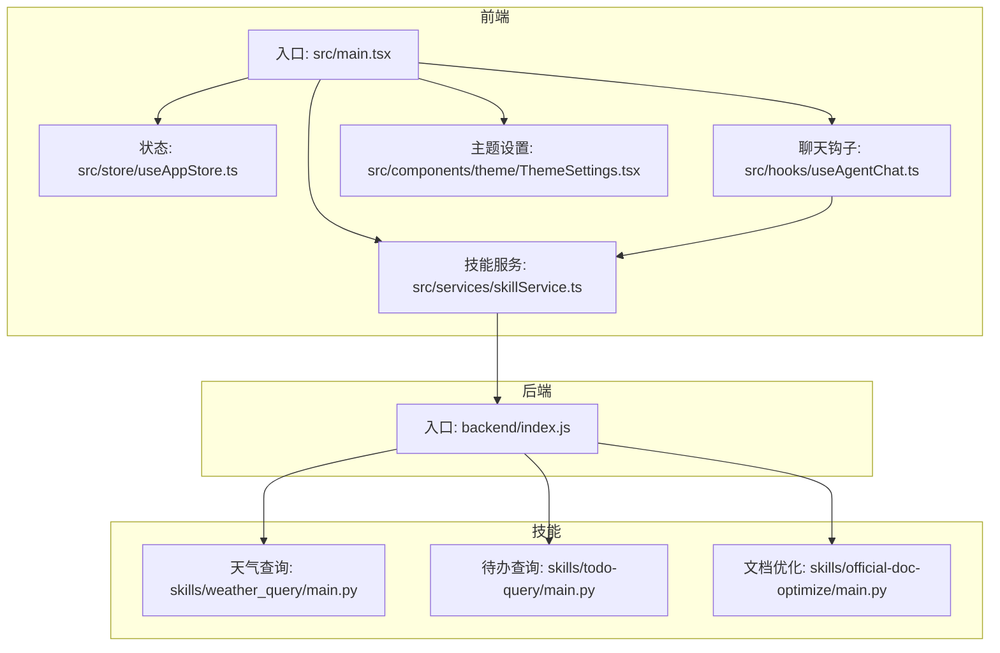
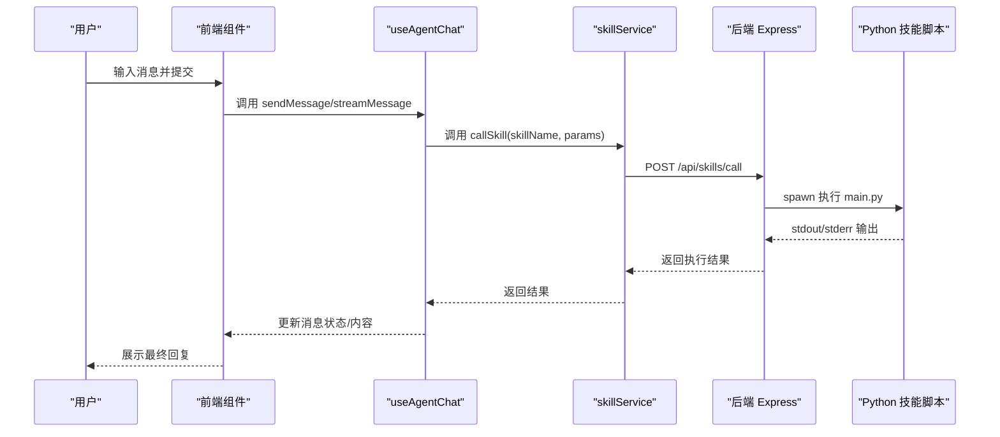
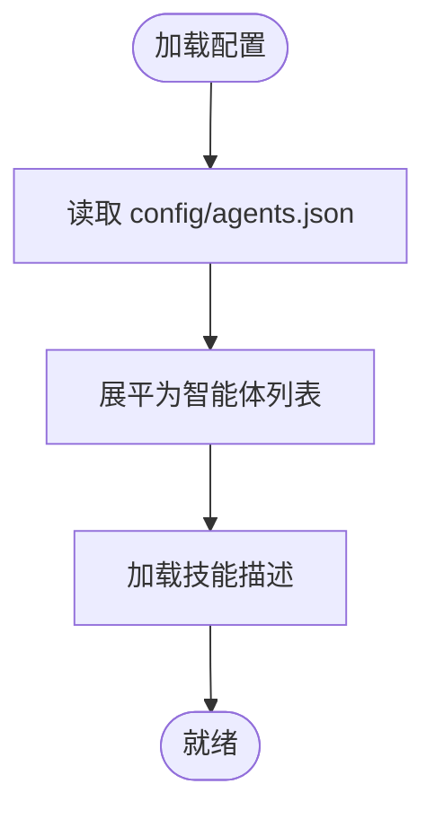
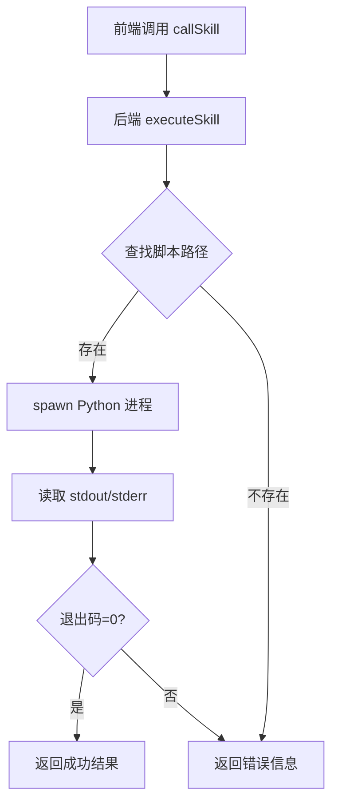
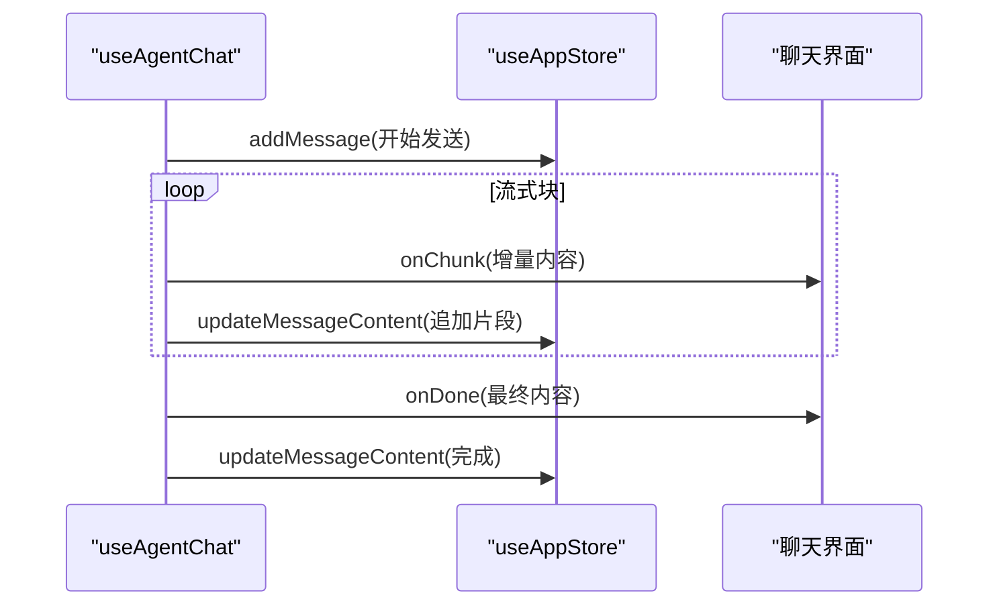
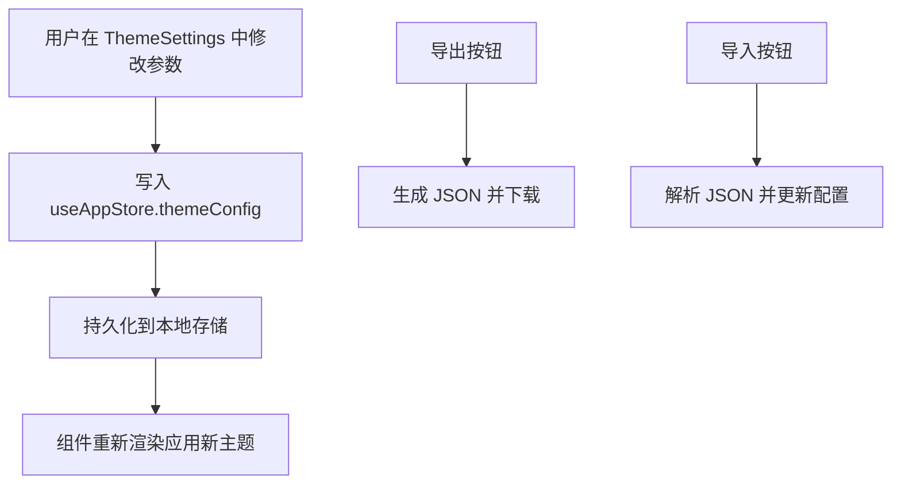
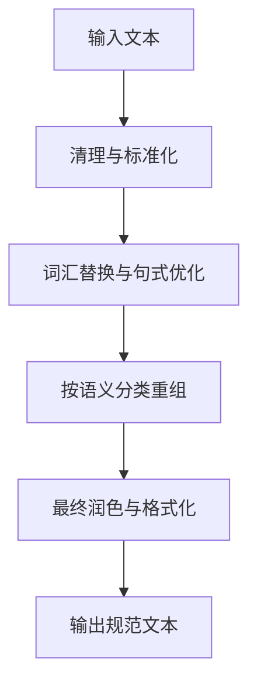
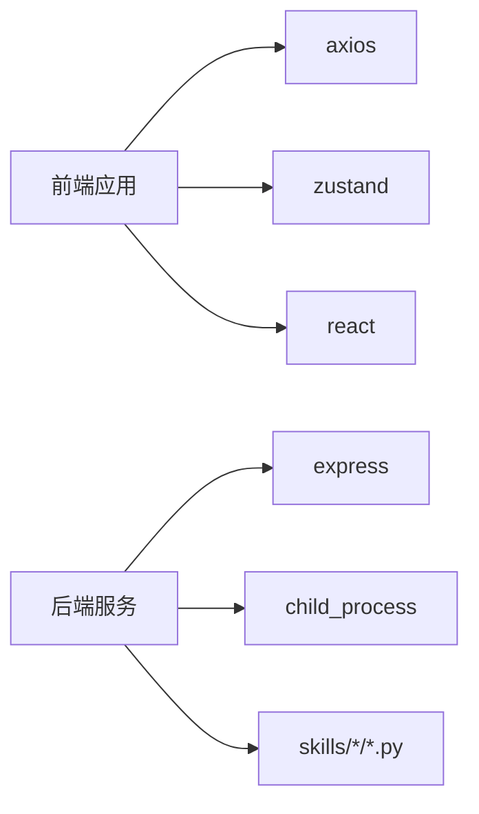

# 核心特性

<cite>
**本文引用的文件**
- [package.json](file://package.json)
- [backend/index.js](file://backend/index.js)
- [src/main.tsx](file://src/main.tsx)
- [config/agents.json](file://config/agents.json)
- [skills/weather_query/main.py](file://skills/weather_query/main.py)
- [skills/todo-query/main.py](file://skills/todo-query/main.py)
- [skills/official-doc-optimize/main.py](file://skills/official-doc-optimize/main.py)
- [src/services/skillService.ts](file://src/services/skillService.ts)
- [src/hooks/useAgentChat.ts](file://src/hooks/useAgentChat.ts)
- [src/store/useAppStore.ts](file://src/store/useAppStore.ts)
- [src/components/theme/ThemeSettings.tsx](file://src/components/theme/ThemeSettings.tsx)
</cite>

## 目录
1. [简介](#简介)
2. [项目结构](#项目结构)
3. [核心组件](#核心组件)
4. [架构总览](#架构总览)
5. [详细组件分析](#详细组件分析)
6. [依赖关系分析](#依赖关系分析)
7. [性能考量](#性能考量)
8. [故障排查指南](#故障排查指南)
9. [结论](#结论)
10. [附录](#附录)

## 简介
本文件面向AutoMate平台的核心特性进行全面介绍，重点覆盖以下能力：
- 智能体管理系统：支持多组智能体、按组聚合、动态加载与配置。
- 技能驱动架构：通过“技能”作为可插拔功能单元，统一调度与执行。
- 实时聊天交互：提供非阻塞流式对话体验，支持思考态与消息状态管理。
- 主题系统：支持明暗主题切换、颜色与排版自定义、主题导入导出。
- 文件处理：内置文档优化等典型文件处理技能，可扩展至更多格式。

这些特性协同工作，形成“智能体+技能+主题+交互”的统一平台体验，既满足日常办公场景（如待办、天气、文档优化），也便于扩展新的技能与主题。

## 项目结构
AutoMate采用前后端分离架构：
- 前端基于React + TypeScript，通过Vite构建，路由入口在main.tsx。
- 后端以Express提供REST API，负责技能调用转发与执行。
- 技能以独立Python脚本形式存放于skills目录，通过后端统一调度。
- 配置文件agents.json集中管理智能体与技能清单。

图表来源
- [src/main.tsx](file://src/main.tsx#L1-L12)
- [src/store/useAppStore.ts](file://src/store/useAppStore.ts#L1-L306)
- [src/hooks/useAgentChat.ts](file://src/hooks/useAgentChat.ts#L1-L128)
- [src/services/skillService.ts](file://src/services/skillService.ts#L1-L73)
- [backend/index.js](file://backend/index.js#L1-L117)
- [skills/weather_query/main.py](file://skills/weather_query/main.py#L1-L139)
- [skills/todo-query/main.py](file://skills/todo-query/main.py#L1-L34)
- [skills/official-doc-optimize/main.py](file://skills/official-doc-optimize/main.py#L1-L208)

章节来源
- [package.json](file://package.json#L1-L47)
- [src/main.tsx](file://src/main.tsx#L1-L12)
- [backend/index.js](file://backend/index.js#L1-L117)
- [config/agents.json](file://config/agents.json#L1-L119)

## 核心组件
- 智能体管理系统：通过agents.json集中配置智能体与技能，前端在首次渲染时拉取并展开为扁平列表，供侧边栏与聊天选择使用。
- 技能驱动架构：前端通过skillService封装调用，后端以Express监听/api/skills/call，根据skill_name定位对应Python脚本执行，并将结果回传。
- 实时聊天交互：useAgentChat提供sendMessage与streamMessage，支持流式增量输出与错误处理；消息状态与思考态由useAppStore统一管理。
- 主题系统：ThemeSettings提供明暗主题切换、颜色与排版参数调整，并支持导入导出主题配置。
- 文件处理：official-doc-optimize技能将输入内容优化为政府公文风格，体现AutoMate在文档处理上的能力边界与扩展潜力。

章节来源
- [config/agents.json](file://config/agents.json#L1-L119)
- [src/hooks/useAgentChat.ts](file://src/hooks/useAgentChat.ts#L1-L128)
- [src/services/skillService.ts](file://src/services/skillService.ts#L1-L73)
- [backend/index.js](file://backend/index.js#L1-L117)
- [src/store/useAppStore.ts](file://src/store/useAppStore.ts#L1-L306)
- [src/components/theme/ThemeSettings.tsx](file://src/components/theme/ThemeSettings.tsx#L1-L262)
- [skills/official-doc-optimize/main.py](file://skills/official-doc-optimize/main.py#L1-L208)

## 架构总览
AutoMate的交互链路如下：
- 前端发起聊天请求，useAgentChat根据选中的agent与技能描述组装上下文。
- skillService向后端发送技能调用请求，携带参数与消息标识。
- 后端根据skill_name拼接Python脚本路径，spawn进程执行，收集stdout/stderr并返回结果。
- 前端接收结果，更新消息状态与内容，支持流式渲染。

图表来源
- [src/hooks/useAgentChat.ts](file://src/hooks/useAgentChat.ts#L51-L119)
- [src/services/skillService.ts](file://src/services/skillService.ts#L12-L61)
- [backend/index.js](file://backend/index.js#L19-L79)

## 详细组件分析

### 智能体管理系统
- 配置结构：agents.json以“组-智能体-技能”三层结构组织，支持不同业务域的智能体集合。
- 加载流程：useAgentChat在初始化时读取agents.json，展平为全局可用的智能体列表，并预加载技能描述，便于聊天时进行技能匹配与提示。
- 使用场景：通用助手组适合日常问答与轻量工具调用；OA办公系统组适合开发、待办等专业领域。

图表来源
- [config/agents.json](file://config/agents.json#L1-L119)
- [src/hooks/useAgentChat.ts](file://src/hooks/useAgentChat.ts#L25-L49)

章节来源
- [config/agents.json](file://config/agents.json#L1-L119)
- [src/hooks/useAgentChat.ts](file://src/hooks/useAgentChat.ts#L25-L49)

### 技能驱动架构
- 统一入口：后端提供/api/skills/call，接收skill_name与parameters，内部spawn对应Python脚本执行。
- 参数传递：前端通过skillService将messageId、agentId等上下文参数透传给技能脚本，便于日志追踪与状态关联。
- 典型技能：
  - 天气查询：解析输入城市，调用开放天气API，格式化输出。
  - 待办查询：模拟待办统计，用于演示技能返回文本的稳定性。
  - 文档优化：将口语化内容转换为政府公文风格，展示复杂文本处理能力。

图表来源
- [backend/index.js](file://backend/index.js#L19-L79)
- [src/services/skillService.ts](file://src/services/skillService.ts#L12-L61)
- [skills/weather_query/main.py](file://skills/weather_query/main.py#L100-L126)
- [skills/todo-query/main.py](file://skills/todo-query/main.py#L5-L21)
- [skills/official-doc-optimize/main.py](file://skills/official-doc-optimize/main.py#L3-L113)

章节来源
- [backend/index.js](file://backend/index.js#L1-L117)
- [src/services/skillService.ts](file://src/services/skillService.ts#L1-L73)
- [skills/weather_query/main.py](file://skills/weather_query/main.py#L1-L139)
- [skills/todo-query/main.py](file://skills/todo-query/main.py#L1-L34)
- [skills/official-doc-optimize/main.py](file://skills/official-doc-optimize/main.py#L1-L208)

### 实时聊天交互
- 流式输出：streamMessage通过异步迭代器逐块推送内容，onChunk实时更新UI，onDone汇总最终结果。
- 错误处理：对网络错误、超时、后端异常进行分类处理，保证用户体验与可观测性。
- 状态管理：useAppStore统一维护消息列表、打字态、思考态与内容片段，支持撤销AI消息、更新思考内容等操作。

图表来源
- [src/hooks/useAgentChat.ts](file://src/hooks/useAgentChat.ts#L84-L119)
- [src/store/useAppStore.ts](file://src/store/useAppStore.ts#L143-L209)

章节来源
- [src/hooks/useAgentChat.ts](file://src/hooks/useAgentChat.ts#L1-L128)
- [src/store/useAppStore.ts](file://src/store/useAppStore.ts#L1-L306)

### 主题系统
- 明暗主题：ThemeSettings提供light/dark切换，自动应用默认配色方案。
- 自定义参数：支持主色、辅色、文本色、背景色、边框色、字号、字重、动画开关与时长。
- 导入导出：将当前主题配置序列化为JSON文件，便于团队共享与备份。

图表来源
- [src/components/theme/ThemeSettings.tsx](file://src/components/theme/ThemeSettings.tsx#L34-L106)
- [src/store/useAppStore.ts](file://src/store/useAppStore.ts#L262-L284)

章节来源
- [src/components/theme/ThemeSettings.tsx](file://src/components/theme/ThemeSettings.tsx#L1-L262)
- [src/store/useAppStore.ts](file://src/store/useAppStore.ts#L1-L306)

### 文件处理（以文档优化为例）
- 输入优化：将口语化表达替换为正式公文用语，规范化句式与标点，按目的/措施/结果等维度组织段落。
- 输出质量：确保句末标点、去重空格、避免重复标点，输出更规范的文本。
- 扩展空间：可在此基础上增加更多格式（如Excel、PDF、Markdown）的解析与生成技能。

图表来源
- [skills/official-doc-optimize/main.py](file://skills/official-doc-optimize/main.py#L3-L113)
- [skills/official-doc-optimize/main.py](file://skills/official-doc-optimize/main.py#L116-L179)
- [skills/official-doc-optimize/main.py](file://skills/official-doc-optimize/main.py#L182-L208)

章节来源
- [skills/official-doc-optimize/main.py](file://skills/official-doc-optimize/main.py#L1-L208)

## 依赖关系分析
- 前端依赖：React、Zustand（状态）、axios（HTTP）、路由与样式框架等。
- 后端依赖：Express、child_process（进程管理）、跨域支持等。
- 技能依赖：Python运行时与第三方库（如requests），由后端统一spawn执行。

图表来源
- [package.json](file://package.json#L15-L26)
- [backend/index.js](file://backend/index.js#L1-L117)

章节来源
- [package.json](file://package.json#L1-L47)
- [backend/index.js](file://backend/index.js#L1-L117)

## 性能考量
- 技能执行：Python进程spawn开销与I/O延迟需关注，建议对高频技能进行缓存或合并请求。
- 前端渲染：流式输出应避免频繁重渲染，可通过批量更新策略减少重绘。
- 网络超时：skillService设置合理超时时间，避免长时间阻塞UI线程。
- 主题渲染：大量CSS变量计算可能影响低端设备，建议限制动画时长与复杂度。

## 故障排查指南
- 后端未启动：前端报网络错误，检查后端命令是否运行（npm run backend）。
- 技能缺失：后端找不到脚本路径，确认agents.json中的storage_path与实际目录一致。
- 参数错误：后端返回技能执行失败，检查前端传参是否包含必需字段（如messageId、agentId）。
- 超时问题：前端捕获超时错误，适当延长超时阈值或优化技能执行逻辑。
- 主题导入失败：导入文件格式不正确，检查JSON结构与字段完整性。

章节来源
- [src/services/skillService.ts](file://src/services/skillService.ts#L34-L60)
- [backend/index.js](file://backend/index.js#L81-L104)
- [src/components/theme/ThemeSettings.tsx](file://src/components/theme/ThemeSettings.tsx#L87-L106)

## 结论
AutoMate通过“智能体+技能+主题+交互”的组合，实现了从配置到执行再到体验的完整闭环。智能体管理提供清晰的业务分组，技能驱动架构确保功能可插拔与可扩展，实时聊天交互保障流畅的用户体验，主题系统则提升了个性化与可维护性。这些特性协同工作，使AutoMate既能快速落地日常办公需求，也能为未来扩展新的技能与主题提供坚实基础。

## 附录
- 使用示例（概念性说明，不展示具体代码）：
  - 调用天气技能：在聊天中输入“查询深圳天气”，前端通过skillService调用后端，后端spawn天气脚本，返回格式化天气信息。
  - 文档优化：粘贴一段口语化文本，调用文档优化技能，得到更规范的公文风格输出。
  - 主题定制：在主题设置中切换深色模式、调整主色与字号，导出当前主题配置以便团队复用。