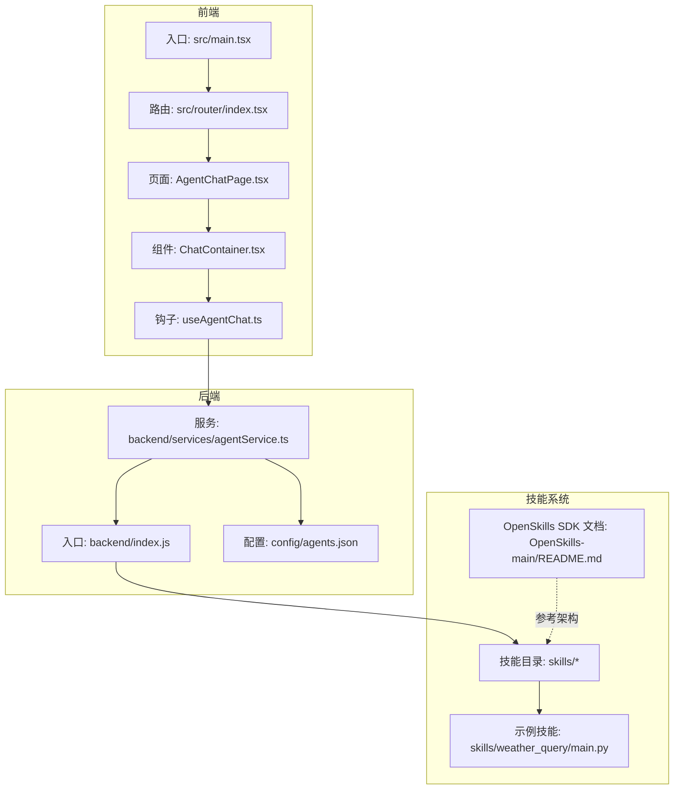
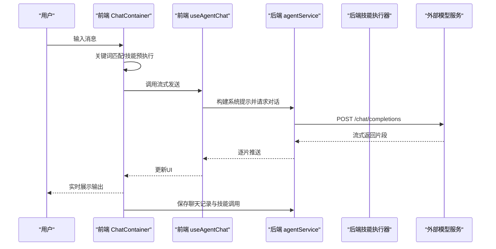
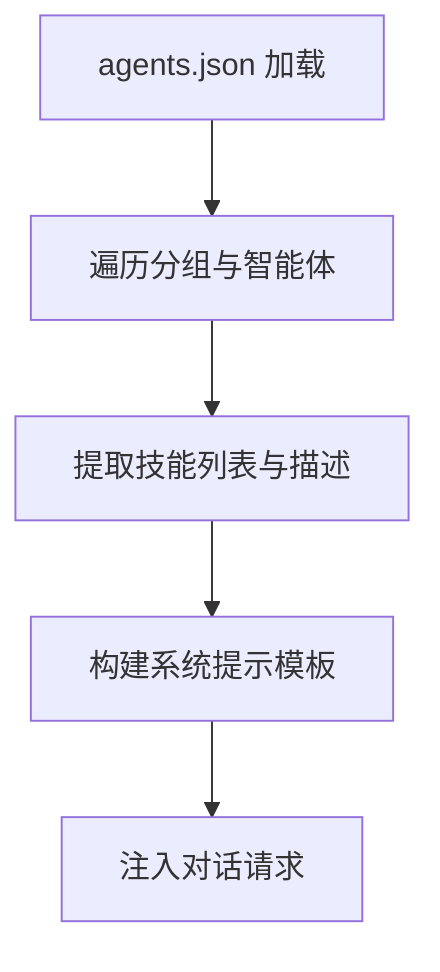
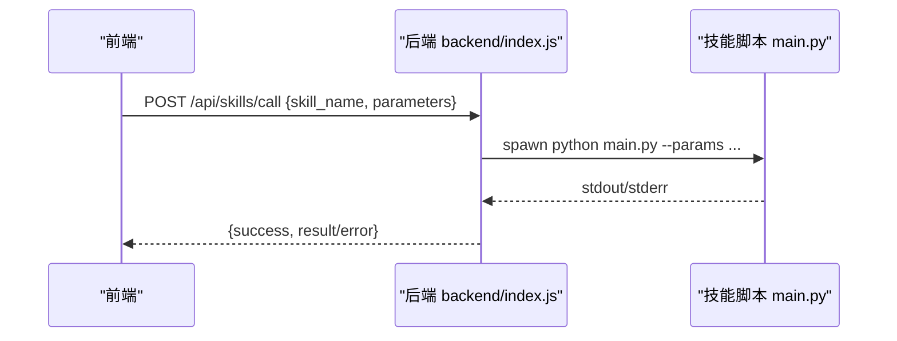
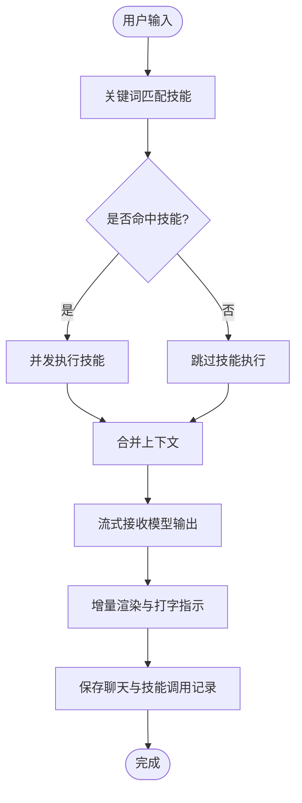
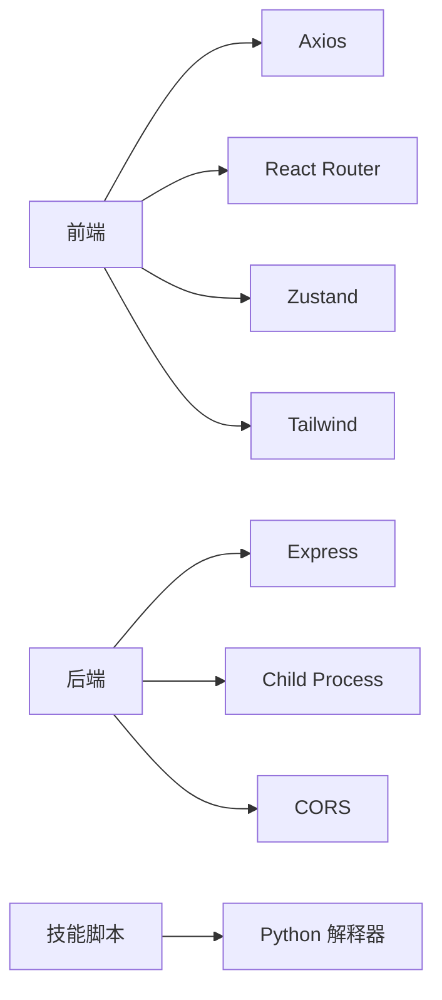

# 项目介绍

<cite>
**本文引用的文件**
- [package.json](file://package.json)
- [backend/index.js](file://backend/index.js)
- [backend/services/agentService.ts](file://backend/services/agentService.ts)
- [config/agents.json](file://config/agents.json)
- [skills/weather_query/main.py](file://skills/weather_query/main.py)
- [src/main.tsx](file://src/main.tsx)
- [src/router/index.tsx](file://src/router/index.tsx)
- [src/pages/AgentChatPage.tsx](file://src/pages/AgentChatPage.tsx)
- [src/components/chat/ChatContainer.tsx](file://src/components/chat/ChatContainer.tsx)
- [src/hooks/useAgentChat.ts](file://src/hooks/useAgentChat.ts)
- [OpenSkills-main/README.md](file://OpenSkills-main/README.md)
</cite>

## 目录
1. [引言](#引言)
2. [项目结构](#项目结构)
3. [核心组件](#核心组件)
4. [架构总览](#架构总览)
5. [详细组件分析](#详细组件分析)
6. [依赖关系分析](#依赖关系分析)
7. [性能考量](#性能考量)
8. [故障排查指南](#故障排查指南)
9. [结论](#结论)
10. [附录](#附录)

## 引言
AutoMate 是一个面向未来的智能体交互平台，旨在通过“技能驱动”的架构，将多模态大模型能力与可插拔的“技能”相结合，提供即开即用、可扩展、可组合的智能交互体验。平台的核心使命是降低智能体应用的开发与集成门槛，让不同背景的用户都能以自然语言与智能体进行高效协作，从而改变传统软件“功能固定、交互单一”的模式。

- 核心愿景：构建一个“技能即服务”的智能体生态，使复杂任务自动化、可编排、可追踪。
- 核心价值：以最小成本接入多模型、多技能，实现“所想即所用”的人机协作新范式。

## 项目结构
AutoMate 采用前后端分离与技能脚本解耦的设计：
- 前端基于 React + TypeScript，负责用户界面、路由与交互状态管理；
- 后端基于 Node.js + Express，提供技能调用与智能体对话的桥接服务；
- 技能以独立 Python 脚本形式存在，通过统一的调用协议被智能体按需触发；
- 配置中心集中管理智能体与技能清单，支持动态加载与热切换。

图表来源
- [src/main.tsx](file://src/main.tsx#L1-L12)
- [src/router/index.tsx](file://src/router/index.tsx#L1-L43)
- [src/pages/AgentChatPage.tsx](file://src/pages/AgentChatPage.tsx#L1-L24)
- [src/components/chat/ChatContainer.tsx](file://src/components/chat/ChatContainer.tsx#L1-L756)
- [src/hooks/useAgentChat.ts](file://src/hooks/useAgentChat.ts#L1-L128)
- [backend/index.js](file://backend/index.js#L1-L117)
- [backend/services/agentService.ts](file://backend/services/agentService.ts#L1-L245)
- [config/agents.json](file://config/agents.json#L1-L119)
- [skills/weather_query/main.py](file://skills/weather_query/main.py#L1-L139)
- [OpenSkills-main/README.md](file://OpenSkills-main/README.md#L1-L411)

章节来源
- [package.json](file://package.json#L1-L47)
- [src/main.tsx](file://src/main.tsx#L1-L12)
- [src/router/index.tsx](file://src/router/index.tsx#L1-L43)
- [backend/index.js](file://backend/index.js#L1-L117)

## 核心组件
- 智能体管理与系统提示构建
  - 通过配置文件集中管理智能体分组、描述、模型与技能集合，并在会话前构建系统提示，明确可用技能边界，提升意图识别与技能匹配的准确性。
- 实时聊天与流式输出
  - 前端提供增强消息气泡、打字指示、滚动控制与重试机制；后端以流式方式接收模型输出并逐步渲染，提升交互流畅度。
- 技能驱动架构
  - 基于 OpenSkills 的三层渐进披露架构（元数据/指令/资源），结合关键词与语义匹配，自动触发对应技能脚本，实现“所问即所做”。

章节来源
- [config/agents.json](file://config/agents.json#L1-L119)
- [backend/services/agentService.ts](file://backend/services/agentService.ts#L98-L116)
- [src/components/chat/ChatContainer.tsx](file://src/components/chat/ChatContainer.tsx#L105-L172)
- [OpenSkills-main/README.md](file://OpenSkills-main/README.md#L251-L269)

## 架构总览
AutoMate 的整体交互流程如下：
- 用户在聊天页输入消息；
- 前端根据当前智能体的可用技能进行关键词匹配，必要时先执行相关技能；
- 将用户消息与技能结果拼接为上下文，调用后端代理；
- 后端根据智能体配置转发至外部模型服务，获取流式响应；
- 前端逐步渲染输出，同时持久化聊天记录与技能调用轨迹。

图表来源
- [src/components/chat/ChatContainer.tsx](file://src/components/chat/ChatContainer.tsx#L240-L392)
- [src/hooks/useAgentChat.ts](file://src/hooks/useAgentChat.ts#L84-L119)
- [backend/services/agentService.ts](file://backend/services/agentService.ts#L118-L185)

## 详细组件分析

### 组件一：智能体与技能配置（agents.json）
- 作用：集中定义智能体分组、描述、模型与技能清单，支撑系统提示构建与技能匹配。
- 特性：支持多模型、多技能、按组分类，便于扩展与运维。

图表来源
- [config/agents.json](file://config/agents.json#L1-L119)
- [backend/services/agentService.ts](file://backend/services/agentService.ts#L58-L116)

章节来源
- [config/agents.json](file://config/agents.json#L1-L119)
- [backend/services/agentService.ts](file://backend/services/agentService.ts#L58-L116)

### 组件二：技能调用与执行（后端）
- 作用：接收前端请求，解析技能名与参数，调用本地 Python 脚本执行，并返回结果。
- 特性：统一错误处理、编码与超时控制，保障稳定性。

图表来源
- [backend/index.js](file://backend/index.js#L19-L79)
- [skills/weather_query/main.py](file://skills/weather_query/main.py#L116-L139)

章节来源
- [backend/index.js](file://backend/index.js#L19-L79)
- [skills/weather_query/main.py](file://skills/weather_query/main.py#L1-L139)

### 组件三：实时聊天与流式渲染（前端）
- 作用：实现消息输入、技能预执行、流式输出、重试与持久化。
- 特性：支持 Markdown 渲染、思考片段解析、时间戳分隔、主题适配等。

图表来源
- [src/components/chat/ChatContainer.tsx](file://src/components/chat/ChatContainer.tsx#L105-L172)
- [src/components/chat/ChatContainer.tsx](file://src/components/chat/ChatContainer.tsx#L174-L211)
- [src/components/chat/ChatContainer.tsx](file://src/components/chat/ChatContainer.tsx#L240-L392)

章节来源
- [src/components/chat/ChatContainer.tsx](file://src/components/chat/ChatContainer.tsx#L105-L172)
- [src/components/chat/ChatContainer.tsx](file://src/components/chat/ChatContainer.tsx#L174-L211)
- [src/components/chat/ChatContainer.tsx](file://src/components/chat/ChatContainer.tsx#L240-L392)

### 组件四：OpenSkills 技能框架参考
- 作用：提供技能定义、引用加载、脚本执行与沙盒环境的参考实现，指导技能开发与集成。
- 特性：三层渐进披露、自动发现、多模型支持、安全沙盒。

章节来源
- [OpenSkills-main/README.md](file://OpenSkills-main/README.md#L1-L411)

## 依赖关系分析
- 前端依赖
  - React 生态与状态管理（Zustand）、路由（React Router）、HTTP 请求（Axios）、样式（Tailwind）。
- 后端依赖
  - Express 提供 REST 接口，子进程调用 Python 脚本，CORS 支持跨域。
- 技能依赖
  - 通过统一的 Python 脚本协议与参数传递，实现与模型服务解耦。

图表来源
- [package.json](file://package.json#L15-L45)
- [backend/index.js](file://backend/index.js#L1-L117)

章节来源
- [package.json](file://package.json#L15-L45)
- [backend/index.js](file://backend/index.js#L1-L117)

## 性能考量
- 流式渲染与增量更新：前端对模型输出进行流式拼接与定时刷新，减少大文本一次性渲染带来的卡顿。
- 技能预执行：在对话前先行执行相关技能，将结果作为上下文注入，缩短最终响应时间。
- 存储与缓存：混合存储策略（内存+IndexedDB/sql.js）提升历史消息加载效率。
- 错误与超时：后端设置合理的超时与错误返回，避免长时间阻塞影响用户体验。

## 故障排查指南
- 技能执行失败
  - 检查技能脚本是否存在、参数是否正确、Python 环境是否就绪。
  - 查看后端日志中的 stderr 输出与退出码。
- 对话接口异常
  - 确认智能体配置中的模型地址与密钥有效，检查网络连通性与超时设置。
  - 若模型返回错误，查看后端返回的错误信息并核对请求体。
- 前端渲染异常
  - 检查聊天历史加载逻辑与混合存储初始化状态，确认消息状态字段与 UI 映射一致。

章节来源
- [backend/index.js](file://backend/index.js#L71-L78)
- [backend/services/agentService.ts](file://backend/services/agentService.ts#L161-L184)
- [src/components/chat/ChatContainer.tsx](file://src/components/chat/ChatContainer.tsx#L16-L28)

## 结论
AutoMate 以“智能体 + 技能”的双轮驱动，实现了从“被动响应”到“主动执行”的交互跃迁。通过可插拔的技能体系、流式的实时对话与完善的配置管理，平台能够覆盖从日常办公到专业领域的多样化场景，帮助不同背景的用户快速构建高价值的人机协作应用。

## 附录

### 主要应用场景与价值
- 智能体管理
  - 通过配置文件集中管理多智能体与技能，支持按组分类与动态扩展，降低运维成本。
- 技能驱动架构
  - 将具体任务封装为技能脚本，实现“所问即所做”，显著提升任务自动化效率。
- 实时聊天功能
  - 提供流畅的对话体验与技能预执行，满足即时反馈与复杂推理需求。

### 目标用户与使用场景
- 企业与团队
  - OA 办公、文档处理、数据分析、代码辅助等场景，通过智能体与技能组合提升生产力。
- 个人开发者
  - 快速搭建个人助理、知识管理与创意工具，按需扩展技能与模型。
- 技术集成者
  - 以统一接口对接多模型与多技能，构建可扩展的智能体应用平台。

### 创新点与竞争优势
- 三层渐进披露的技能架构，兼顾发现效率与执行性能；
- 技能与模型解耦，支持多模型平滑切换；
- 前端流式渲染与技能预执行，显著改善交互体验；
- 统一的技能调用协议与错误处理，降低集成与维护成本。