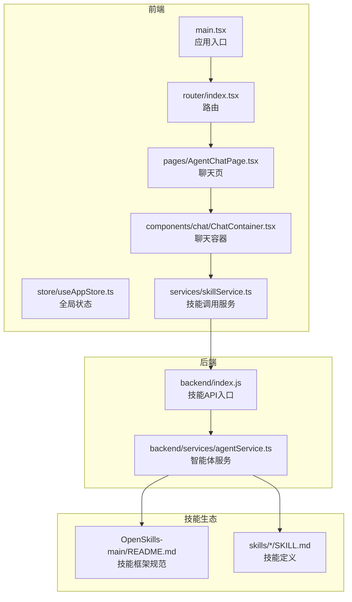
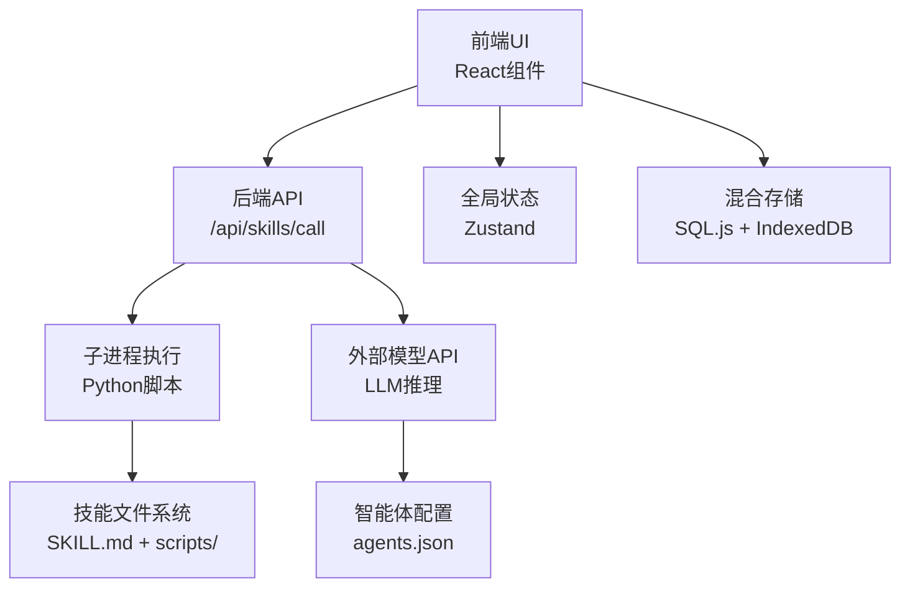
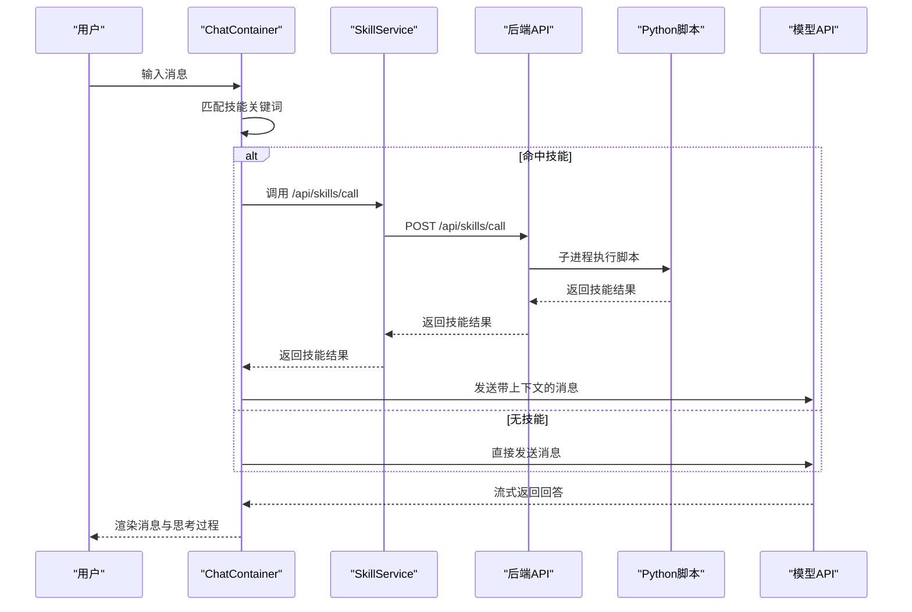
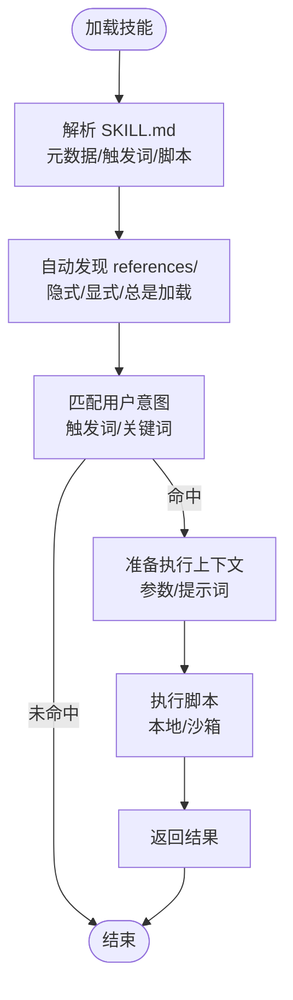
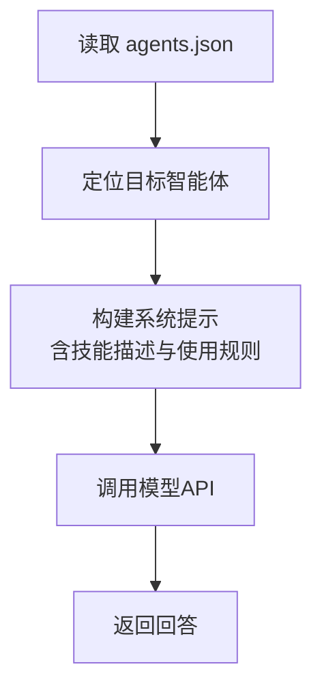
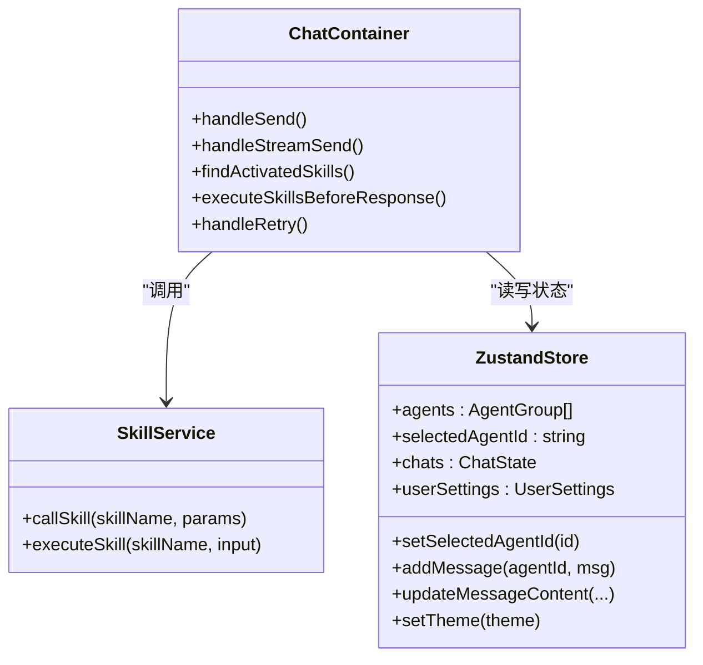
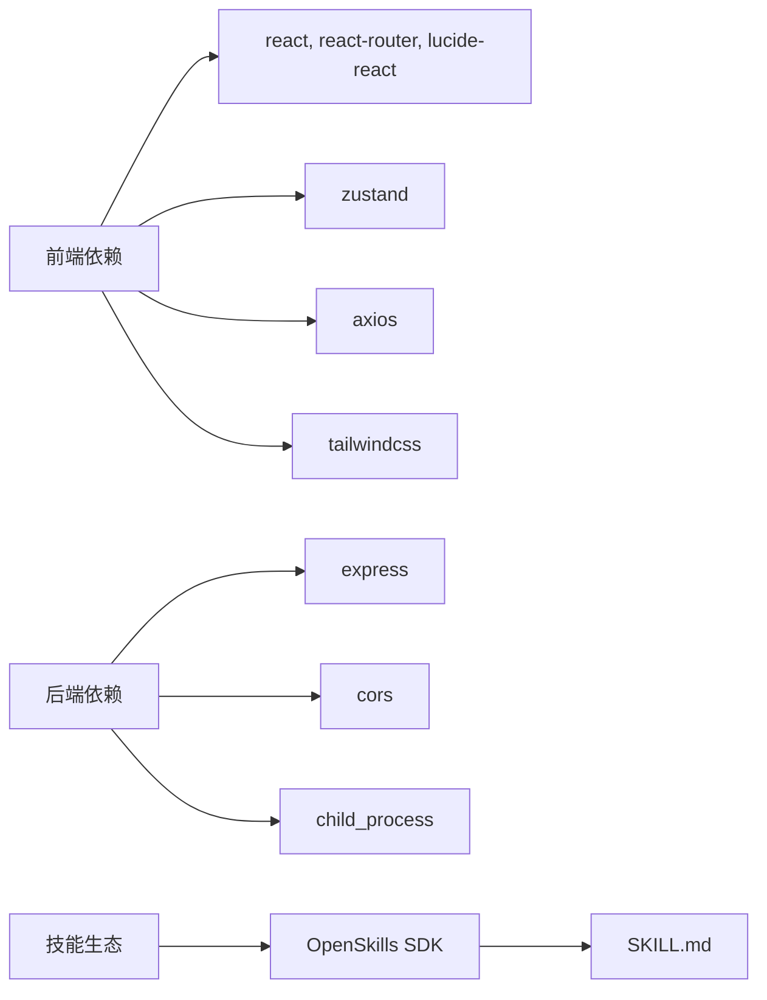

# 项目概述

<cite>
**本文引用的文件**
- [package.json](file://package.json)
- [src/main.tsx](file://src/main.tsx)
- [backend/index.js](file://backend/index.js)
- [config/agents.json](file://config/agents.json)
- [src/router/index.tsx](file://src/router/index.tsx)
- [src/pages/AgentChatPage.tsx](file://src/pages/AgentChatPage.tsx)
- [src/services/skillService.ts](file://src/services/skillService.ts)
- [skills/todo-query/SKILL.md](file://skills/todo-query/SKILL.md)
- [OpenSkills-main/README.md](file://OpenSkills-main/README.md)
- [src/store/useAppStore.ts](file://src/store/useAppStore.ts)
- [src/components/chat/ChatContainer.tsx](file://src/components/chat/ChatContainer.tsx)
- [backend/services/agentService.ts](file://backend/services/agentService.ts)
- [docs/技术架构/后端技术栈.md](file://docs/技术架构/后端技术栈.md)
- [docs/接口层设计/Tauri通信接口.md](file://docs/接口层设计/Tauri通信接口.md)
</cite>

## 目录
1. [引言](#引言)
2. [项目结构](#项目结构)
3. [核心组件](#核心组件)
4. [架构总览](#架构总览)
5. [详细组件分析](#详细组件分析)
6. [依赖关系分析](#依赖关系分析)
7. [性能考虑](#性能考虑)
8. [故障排查指南](#故障排查指南)
9. [结论](#结论)
10. [附录](#附录)

## 引言
AutoMate 是一个基于 Tauri 框架的桌面智能体交互平台，旨在通过“智能体 + 技能”的解耦架构，提供可组合、可扩展、可演进的桌面级 AI 助手体验。项目采用前端 React + TypeScript + Vite，后端 Node.js 提供 API 与技能执行桥接，并通过 OpenSkills 技能框架实现“技能即插拔”的能力扩展。其独特价值在于：
- 桌面原生体验：借助 Tauri 的轻量内核与系统集成能力，提供低延迟、高安全性的本地化桌面应用。
- 智能体管理：集中式智能体配置与分组管理，支持多智能体并行与切换。
- 技能驱动架构：以 SKILL.md 为契约，统一声明技能元数据、触发词与脚本入口，实现“按需加载、按需执行”。
- 实时聊天：流式响应、思考过程可视化、消息持久化与重试机制，提升交互体验。

## 项目结构
AutoMate 采用“前端 + 后端 + 技能生态 + 文档规范”的组织方式：
- 前端（React + TypeScript + Vite）：页面路由、组件、状态管理、服务封装与聊天界面。
- 后端（Node.js）：REST 风格 API、智能体与技能服务、Python 子进程执行桥接。
- 技能生态（OpenSkills）：标准化技能定义与执行，支持本地脚本与沙箱执行。
- 文档（docs）：技术架构、接口设计、非功能性设计等规范。

图表来源
- [src/main.tsx](file://src/main.tsx#L1-L12)
- [src/router/index.tsx](file://src/router/index.tsx#L1-L43)
- [src/pages/AgentChatPage.tsx](file://src/pages/AgentChatPage.tsx#L1-L24)
- [src/components/chat/ChatContainer.tsx](file://src/components/chat/ChatContainer.tsx#L1-L756)
- [src/services/skillService.ts](file://src/services/skillService.ts#L1-L73)
- [backend/index.js](file://backend/index.js#L1-L117)
- [backend/services/agentService.ts](file://backend/services/agentService.ts#L1-L245)
- [OpenSkills-main/README.md](file://OpenSkills-main/README.md#L1-L411)
- [skills/todo-query/SKILL.md](file://skills/todo-query/SKILL.md#L1-L24)

章节来源
- [package.json](file://package.json#L1-L47)
- [src/main.tsx](file://src/main.tsx#L1-L12)
- [backend/index.js](file://backend/index.js#L1-L117)
- [OpenSkills-main/README.md](file://OpenSkills-main/README.md#L1-L411)

## 核心组件
- 应用入口与路由
  - 前端入口负责挂载 React 应用与样式；路由定义首页、聊天页与设置页。
- 全局状态管理
  - 使用 Zustand 维护智能体列表、当前选中智能体、聊天会话、主题与用户设置。
- 聊天容器
  - 负责消息渲染、流式接收、思考过程提取、技能匹配与前置执行、历史加载与持久化。
- 技能服务
  - 封装 /api/skills/call 接口，统一错误处理与超时控制。
- 后端技能 API
  - 暴露 /api/skills/call，通过子进程调用 Python 脚本执行技能，并返回结果。
- 智能体服务
  - 从 agents.json 加载智能体配置，动态构建系统提示，调用外部模型 API 并返回结果。
- 技能生态
  - 以 OpenSkills 为标准，SKILL.md 定义技能元数据、触发词与脚本入口，支持本地执行与沙箱执行。

章节来源
- [src/router/index.tsx](file://src/router/index.tsx#L1-L43)
- [src/store/useAppStore.ts](file://src/store/useAppStore.ts#L1-L306)
- [src/components/chat/ChatContainer.tsx](file://src/components/chat/ChatContainer.tsx#L1-L756)
- [src/services/skillService.ts](file://src/services/skillService.ts#L1-L73)
- [backend/index.js](file://backend/index.js#L1-L117)
- [backend/services/agentService.ts](file://backend/services/agentService.ts#L1-L245)
- [OpenSkills-main/README.md](file://OpenSkills-main/README.md#L1-L411)

## 架构总览
AutoMate 采用“前端 Web + 后端 Node.js + 外部模型服务 + 技能脚本”的分层架构。前端通过 Axios 调用后端 /api/* 接口；后端通过子进程调用 Python 脚本执行技能，或代理到外部模型 API；技能以 OpenSkills 规范定义，具备三层渐进披露能力（元数据、指令、资源）。

图表来源
- [src/components/chat/ChatContainer.tsx](file://src/components/chat/ChatContainer.tsx#L1-L756)
- [src/services/skillService.ts](file://src/services/skillService.ts#L1-L73)
- [backend/index.js](file://backend/index.js#L1-L117)
- [backend/services/agentService.ts](file://backend/services/agentService.ts#L1-L245)
- [config/agents.json](file://config/agents.json#L1-L119)
- [OpenSkills-main/README.md](file://OpenSkills-main/README.md#L1-L411)

## 详细组件分析

### 聊天流程与技能前置执行
聊天容器在发送消息时，先基于用户输入与智能体技能关键词进行匹配，对命中技能进行前置执行，将技能结果注入到后续模型请求中，从而实现“先执行、后生成”的增强交互。

图表来源
- [src/components/chat/ChatContainer.tsx](file://src/components/chat/ChatContainer.tsx#L174-L392)
- [src/services/skillService.ts](file://src/services/skillService.ts#L12-L61)
- [backend/index.js](file://backend/index.js#L81-L104)

章节来源
- [src/components/chat/ChatContainer.tsx](file://src/components/chat/ChatContainer.tsx#L105-L211)
- [src/services/skillService.ts](file://src/services/skillService.ts#L1-L73)
- [backend/index.js](file://backend/index.js#L1-L117)

### 技能定义与执行（OpenSkills）
OpenSkills 通过 SKILL.md 定义技能元数据、触发词、参考文档与脚本入口，支持自动发现与条件加载，实现“声明即能力”。

图表来源
- [OpenSkills-main/README.md](file://OpenSkills-main/README.md#L204-L310)
- [skills/todo-query/SKILL.md](file://skills/todo-query/SKILL.md#L1-L24)

章节来源
- [OpenSkills-main/README.md](file://OpenSkills-main/README.md#L1-L411)
- [skills/todo-query/SKILL.md](file://skills/todo-query/SKILL.md#L1-L24)

### 智能体配置与系统提示构建
后端从 agents.json 加载智能体配置，动态拼接系统提示，将可用技能描述注入到模型上下文中，使智能体具备“可调用技能”的能力。

图表来源
- [backend/services/agentService.ts](file://backend/services/agentService.ts#L58-L116)
- [config/agents.json](file://config/agents.json#L1-L119)

章节来源
- [backend/services/agentService.ts](file://backend/services/agentService.ts#L1-L245)
- [config/agents.json](file://config/agents.json#L1-L119)

### 前端状态与聊天界面
前端使用 Zustand 管理全局状态，包括智能体列表、当前会话、消息队列、打字状态与主题配置；聊天容器负责消息渲染、滚动控制、时间戳与重试逻辑。

图表来源
- [src/store/useAppStore.ts](file://src/store/useAppStore.ts#L56-L305)
- [src/components/chat/ChatContainer.tsx](file://src/components/chat/ChatContainer.tsx#L1-L756)
- [src/services/skillService.ts](file://src/services/skillService.ts#L1-L73)

章节来源
- [src/store/useAppStore.ts](file://src/store/useAppStore.ts#L1-L306)
- [src/components/chat/ChatContainer.tsx](file://src/components/chat/ChatContainer.tsx#L1-L756)
- [src/services/skillService.ts](file://src/services/skillService.ts#L1-L73)

## 依赖关系分析
- 前端依赖
  - React 生态（React、React Router、Lucide Icons）、状态管理（Zustand）、网络请求（Axios）、样式（TailwindCSS）。
- 后端依赖
  - Express 提供 REST API、CORS 支持、子进程调用 Python 脚本。
- 技能生态
  - OpenSkills 标准化技能定义与执行，SKILL.md 作为技能契约。

图表来源
- [package.json](file://package.json#L15-L44)
- [backend/index.js](file://backend/index.js#L1-L16)
- [OpenSkills-main/README.md](file://OpenSkills-main/README.md#L1-L411)

章节来源
- [package.json](file://package.json#L1-L47)
- [backend/index.js](file://backend/index.js#L1-L117)
- [OpenSkills-main/README.md](file://OpenSkills-main/README.md#L1-L411)

## 性能考虑
- 前端
  - 使用虚拟滚动与懒加载减少 DOM 压力；Zustand 状态粒度拆分避免全局重渲染。
  - 流式渲染：按字符增量更新，降低首屏延迟。
- 后端
  - 子进程执行技能时设置超时与编码环境变量，避免阻塞与乱码。
  - 对外模型调用设置超时与错误分类，快速失败与降级。
- 技能执行
  - OpenSkills 的三层渐进披露：仅在需要时加载指令与资源，降低内存与网络开销。

## 故障排查指南
- 技能调用失败
  - 检查 /api/skills/call 请求是否携带 skill_name 与必要参数；确认 Python 脚本路径与权限；查看后端日志中的子进程退出码与错误输出。
- 网络错误
  - 前端技能服务对网络错误进行分类处理，提示“请确保后端服务正在运行”。确认 npm run backend 是否正常启动。
- 超时问题
  - 技能服务设置了 30 秒超时；若技能执行耗时较长，建议优化脚本或启用沙箱并合理设置超时。
- 模型调用异常
  - 后端代理模型 API 时会区分响应/请求错误与未知错误，检查 agents.json 中的 url、api_key 与 model 配置。

章节来源
- [src/services/skillService.ts](file://src/services/skillService.ts#L12-L61)
- [backend/index.js](file://backend/index.js#L81-L104)
- [backend/services/agentService.ts](file://backend/services/agentService.ts#L118-L184)

## 结论
AutoMate 通过“智能体 + 技能 + 桌面原生”的组合，提供了可扩展、可演进且贴近生产的桌面智能体平台。其核心优势在于：
- 明确的技能契约与渐进披露架构，便于规模化扩展；
- 前后端分离与流式渲染，带来流畅的交互体验；
- Tauri 的桌面集成潜力，为未来引入系统级能力（剪贴板、文件系统、通知等）奠定基础。

## 附录
- 当前版本与脚本
  - package.json 中定义了项目版本与常用脚本（dev、build、preview、backend、start），可用于本地开发与联调。
- 技术栈与接口规范
  - 后端技术栈文档与 Tauri 通信接口文档为系统集成与二次开发提供参考。

章节来源
- [package.json](file://package.json#L6-L13)
- [docs/技术架构/后端技术栈.md](file://docs/技术架构/后端技术栈.md#L1-L380)
- [docs/接口层设计/Tauri通信接口.md](file://docs/接口层设计/Tauri通信接口.md#L1-L800)